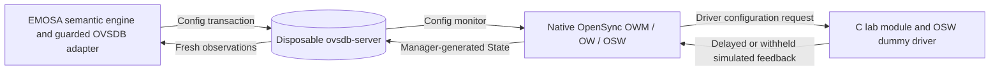

# Native OpenSync R0 experiment

The pinned OpenSync OWM/OW/OSW stack now builds and runs in an isolated Ubuntu
24.04 container. **The backend remains disabled: recovery test N03 fails.**
See the [qualification record](../../docs/evidence/native/qualification.json),
[39 upstream unit results](../../docs/evidence/native/unit-summary.json), and
[end-to-end component probe](../../docs/evidence/native/path-summary.json).
These are semantic, simulated-device results. No EasyMesh frames, Wi-Fi link,
physical pod or independent controller participate in this experiment.



The C module never writes OVSDB tables. The probe seeds only Config, with one
synthetic radio and existing AP. It reuses EMOSA's normal session, transaction,
guard, journal and reconciliation code. Its small `NativeProbe` subclass labels
the observations and interprets OWM's PSK representation. Application config
still rejects `opensync-native`; this harness does not create a physical profile.

## Findings and qualification boundary

| Check | Recorded result |
| --- | --- |
| N01: native build | Fresh source extraction and pinned lab patches build with GCC 13; 39 selected upstream units pass |
| N02: manager path | Config → native callback → simulated feedback → native State → `OBSERVED_APPLIED` |
| N03: withheld application | Config commits; driver feedback withheld; operation times out and prior observed SSID remains |
| N03: database restart | EMOSA becomes unready, reconnects with a new generation, and reads State; a new Config transaction commits, but OWM produces no further callback or State change within the probe deadline |
| N04: isolation | Unprivileged container inside the dedicated VM, private Unix sockets/databases, synthetic inventory, physical drivers disabled |

The restart failure repeats with the clean source build. Process survival and
reading persisted State did **not** prove the manager resumed Config monitoring.
The final operation remains `CONFIG_COMMITTED` when the 15-second observation
probe expires; it is not recorded as applied. The next native task is to qualify
OWM reconnect/resubscription or explicit supervisor restart and state rebuilding.
Do not hide the failure by changing State from the harness.

OWM reports `wpa_key_mgmt=["wpa-psk"]` for the PSK AKM, with separate RSN/CCMP
flags. The simple simulator used `["wpa2-psk"]`. The native probe accepts the
first representation only with explicitly observed false values for all six
alternative cipher flags; 12 mixed/missing-field negatives are checked. This
requires additional monitor columns. A production native profile must qualify
these fields and transaction guards, competing writers, lifecycle and recovery
before the application gate can open. No simulator mapping is qualified for pods.

The source remains pinned to `78d8a7194d5e77635877cc456231e7be5cf03d68`, including
its default native Kconfig. Only `src/owm` is built and run. Upstream native and
null platform stubs remain in that target; no new platform stub was added.
Both `OSW_DRV_TARGET_DISABLED` and `OSW_DRV_NL80211_DISABLE` are set. No hwsim
radio is needed for this dummy-driver test; the [separate radio lab](../hwsim/README.md)
remains the place for hostapd/wpa_supplicant client experiments.

Two recorded upstream lab patches are used:

- `0001-null-group-diagnostic.patch`: format a missing steering group as `(nil)`;
  GCC 13 otherwise rejects the nullable `%s` argument.
- `0002-check-unit-child-exit.patch`: require a zero child exit status in the
  upstream test runner. Its original `WIFEXITED` check accepted any normal exit.

Tests retain upstream fork isolation because one prefix can match several tests
with shared static state. The initial failed attempts are retained in the evidence
directory. Upstream LICENSE/NOTICE stay in the source extraction; copies are in
this directory. No OpenSync binary or entire source tree is shipped in EMOSA's wheel.

## Repeating the bounded experiment

Use only the dedicated `emosa-lab` VM described in the [deployment manual](../README.md).
This run increased that VM's root disk to 20 GiB and left other host instances
unchanged. Its inner `em-controller` and `emosa` containers stayed stopped.
`opensync-native-r0` uses two CPUs and a 1536 MiB limit, with management networking
only. Observed container peak memory was about 791 MiB, including build/cache;
the final probe's maximum child RSS was about 37 MiB. These are component
measurements, not pod resource requirements.

1. Inside the VM, copy this repository to `/opt/emosa`, retain the pinned base
   image, then run `bash deploy/native/prepare.sh`. It refuses existing resources.
2. Copy `deploy/native/` into the candidate container at `/opt/native/lab/native/`.
   Run `bash /opt/native/lab/native/install-build-deps.sh` there. Direct build
   dependency versions are in `build-deps.lock`; the full actual package inventory
   is retained. Missing pinned archive versions must fail, not silently upgrade.
3. On a clean checkout of the pinned OpenSync commit, create the source archive:
   `git archive --format=tar 78d8a7194d5e77635877cc456231e7be5cf03d68 -o opensync-source.tar`.
   Copy it into the container at `/opt/opensync-source.tar`. The build checks its SHA-256.
4. Provide the separately built OVSDB 4.0.0 tools at `/opt/native/ovsdb/`.
   `scripts/build-ovsdb.sh` builds only the server/tool, without installation or a
   switch daemon. This run reused the recorded Ubuntu 24.04 tools from the EMOSA
   component container; their binary hashes are in `runtime.txt`.
5. Install EMOSA at `/opt/emosa` using Python 3.13.7 and `uv sync --frozen` as in
   the deployment manual. This run reused the VM's Python/venv and extracted
   EMOSA revision `e853ecc`; a fresh complete runtime image rebuild/export remains
   pending. The native build's Python 3.12 venv is a separate build dependency.
6. Inside the candidate, run:

   ```sh
   bash /opt/native/lab/native/build.sh
   export EMOSA_NATIVE_ROOT=/opt/native/reproduction
   python3 /opt/native/lab/native/check-units.py
   /opt/emosa/.venv/bin/python /opt/native/lab/native/check-path.py
   ```

   The fresh build refuses an existing `/opt/native/reproduction`. Review a prior
   run before choosing to remove its disposable build directory. The path probe
   currently exits **1** at the documented recovery failure. It prints the private
   evidence directory and retains redacted operations and synthetic driver events.
7. Collect only reviewed evidence, then stop `opensync-native-r0` and `emosa-lab`.
   Keep database/journal/secret directories out of the repository. All passphrases
   used here are explicit synthetic test values; no real credentials are involved.

This experiment satisfies the bounded R0 investigation with a concrete recovery
blocker. It must not delay an available physical experiment. Actual acceptance
still requires **real EasyMesh messages → EMOSA → unchanged physical pod →
independently observed behavior**. The [specification acquisition checklist](../../docs/specification-acquisition.md)
and [private pod connection instructions](../../docs/pod-qualification.md) remain applicable.
