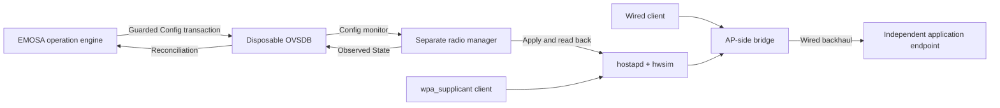

# OVSDB and hwsim integration

This experiment connects the existing semantic EMOSA operation engine to real
OVSDB Config, a separate hostapd/nl80211 manager, and independent wired and
wpa_supplicant client containers. It does not send EasyMesh messages or run
OpenSync firmware. The upstream OpenSync schema remains a simulation reference.



The manager imports neither the operation engine nor its expected-state
predicate. It reads `STATUS` and `GET_CONFIG` from the live hostapd process,
and obtains interface type, SSID, BSSID and channel from `iw`/nl80211. These reads
must agree before it publishes positive State. The observed passphrase comes
through the private hostapd control pipe, not from the desired OVSDB row. Failed
reads clear positive State. Config/reference/State guards prevent publication
against a changed database snapshot; the next monitor cycle resynchronizes.

The hostapd build enables `GET_CONFIG` passphrase reporting with `wps_state=2`.
No WPS enrolment is initiated in this experiment. The client derives its raw
hexadecimal PSK using the standard-library PBKDF2-HMAC-SHA1 primitive, so literal
quote/backslash bytes are preserved without relying on quoted-string escaping.
The final change case includes those characters in its synthetic passphrase.
Applying configuration uses a
full hostapd process restart, so it interrupts Wi-Fi service. It does not use the
native peer's patched `UPDATE` command or native prplMesh HAL.

## Declared scope

- One existing synthetic AP/VIF, one PSK, 2.4 GHz channel 6, 20 MHz, WPA2/CCMP.
- Explicit printable ASCII SSID subset, 8–63 printable ASCII passphrase.
- Fixed radio, BSSID, bridge and radio/VIF references; additional BSSs, PSKs,
  changed channel, backhaul roles and other security modes are unsupported.
- Separate manager process in the VM; an actuator/read helper in the owned AP
  container. The OVSDB server needs no switch datapath.
- The reused baseline controller container is only an application endpoint here.
  All native peer services are stopped; the native evidence remains retained.
- OVSDB State observation is separate from client success. A working AP can have
  a broken forwarding path. The independent client verdict must remain visible.
- Manager reads are periodic; this does not establish a production State lease
  or guaranteed freshness after an unobserved manager crash. No physical mapping
  or hardware write authority is added.

## Prepare and run

First prepare the [native baseline resources](../peer-baseline/README.md), collect
its evidence and stop its services. This experiment exclusively reuses its four
owned containers and assigned hwsim radios; it does not create a new VM or install
host packages. It requires the retained VM Python 3.13.7 environment at
`/opt/emosa/.venv`, its pinned EMOSA dependencies, and Open vSwitch 4.0.0 binaries
at `/opt/native-ovsdb-server` and `/opt/native-ovsdb-tool`. These were retained
by the [native R0 preparation](../native/README.md). Only the database binaries
are reused; the failing native OpenSync manager backend stays disabled.

From the repository on the host:

```sh
python3 deploy/radio-manager/stage.py
lxc exec emosa-lab -- env \
  PYTHONPATH=/opt/emosa-radio-manager/source \
  EMOSA_OVS_BIN=/opt/emosa-radio-manager/ovsdb \
  /opt/emosa/.venv/bin/python /opt/emosa-radio-manager/run.py \
  --label radio-rerun-01
```

Choose a new label on every run. Staging refuses active native or radio-manager
units and active experiment locks. It copies an isolated source tree; the VM's
existing `/opt/emosa` application tree is not edited. The run reattaches the AP
container's wired backhaul and removes its inactive wireless backhaul interface.
Setup Ethernet must already be absent from all four containers.

The run exercises initial association, SSID/key change, idempotent redelivery,
withheld application and late observation, lost reply, wrong key/correct key,
unsupported channel, adapter reconstruction, database/manager restart, wired
backhaul loss/recovery and AP failure/recovery. Client probes bind their IP and
interface, pin the wireless client to the AP BSSID, and require a fresh application
nonce and originating client address. Each client check has a 30-second budget.
Radio/recovery observations have a 30-second budget; operation reconciliation
allows 35 seconds including its declared application deadline. Withheld application
uses a four-second operation deadline and retains the timed-out original outcome.

Raw records, synthetic private configurations, database/journal, radio capture,
source hashes and node logs stay in `/opt/emosa-radio-manager/runs/LABEL/`.
The `finally` collection stops the experiment's services and database, retaining
the running containers/PHY assignments. It leaves the topology in wired mode.
Use the native baseline preparation procedure before resuming that experiment.

Copy raw results to ignored private storage on the host and review only a
small explicit artifact allowlist for publication:

```sh
mkdir -p .lab/radio-manager
chmod 700 .lab/radio-manager
lxc file pull --recursive --quiet \
  emosa-lab/opt/emosa-radio-manager/runs .lab/radio-manager/
```

## Next integration boundary

The completed radio boundary can consume Config changes from a future genuine
EMOSA onboarding exchange. The next path is the pinned EasyMesh controller →
EMOSA virtual-agent discovery/WSC → this OVSDB/radio boundary. The packet endpoint,
controller/exchange binding, full radio-wide request validation and normative
vectors remain pending P0. Existing WSC payload components do not bypass that
gate or authorize a write. The missing IEEE editions and related documents remain
in the [acquisition checklist](../../doc/protocol/specification-acquisition.md).

Once a private pod connection path arrives, collect its read-only profile and
qualify the physical mapping. The eventual acceptance path remains real EasyMesh
messages → EMOSA → unchanged OpenSync pod → independently observed behavior.

Run the focused unprivileged/OVSDB checks with
`uv run pytest tests/test_radio_manager.py`. After retaining and reviewing the
VM history, the publication command for the recorded final selection is:

```sh
python3 scripts/curate-radio-manager.py \
  --private-root .lab/radio-manager \
  --output doc/evidence/radio-manager \
  --selected qualified-04 qualified-05 qualified-06
```

The curator rejects incomplete/preliminary runs, missing cases, altered captures,
incorrect timeout/attribution results, missing new database generations, and
missing or reused client nonces. It publishes an explicit synthetic sample
allowlist; review that output before registering its hashes in the evidence manifest.
