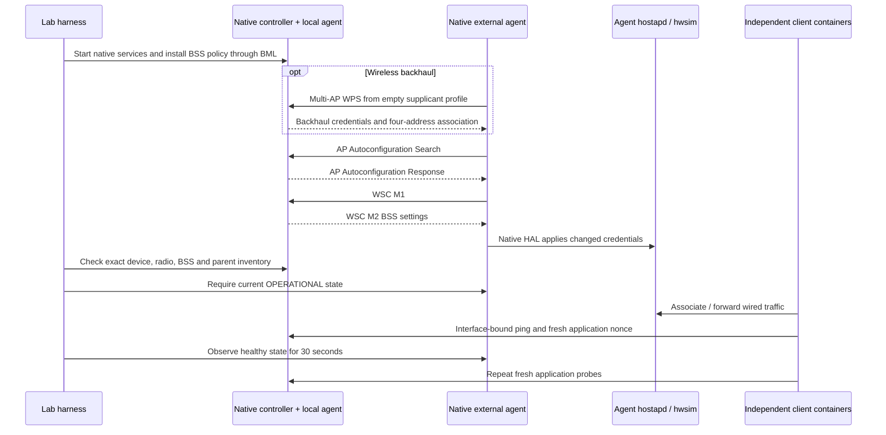

# Native controller–agent baseline

This experiment establishes a bounded reference for the EMOSA evaluation lab:
a pinned native prplMesh controller and native agent communicate over Ethernet
or mac80211_hwsim wireless backhaul, and independent wired/wireless client
containers exercise the resulting data path. EMOSA and OpenSync are absent from
this experiment. It cannot establish that a controller always onboards every
standard EasyMesh agent.

The final acceptance version 2 selection passes 14 cases per backhaul mode:
five fresh onboardings, three agent restarts, three managed controller restarts
and three backhaul interruptions. Both independent clients pass before and after
a 30-second stability observation in every selected case. This is a finite
functional baseline with the native shutdown defect described below.
The machine-readable [execution summary](../evidence/peer-baseline/summary.json)
retains the full attempt history and hashes, including failed earlier procedures
and preliminary checks that did not establish stable onboarding. It retains
78 measured attempts; the 28 selected cases and the two final negative-control
runs are identified explicitly, rather than treating the entire history as a pass.

| Acceptance version 2 case | Wired backhaul | Wireless backhaul |
| --- | --- | --- |
| Fresh onboarding | 5/5 passed | 5/5 passed |
| Agent restart | 3/3 passed | 3/3 passed |
| Managed controller restart | 3/3 passed | 3/3 passed |
| Backhaul interruption | 3/3 settled repetitions passed; earlier failed check retained | 3/3 passed |
| Wrong key and five rejected updates | Passed | Passed |

## What is observed

Every fresh wireless run starts with an empty backhaul supplicant configuration.
Independent radio captures show WPS M1–M8, followed by association with the
controller's backhaul BSSID and four-address data frames. Ethernet captures at
the controller independently show native discovery, response and WSC M1/M2.
Initial agent SSIDs/credentials differ from the controller's policy; the test
requires live hostapd configuration and controller device/radio/BSS inventory
to converge to that policy.

Acceptance version 2 additionally requires the external agent and controller's
local-agent helper to report current `OPERATIONAL` state, including their
fronthauls. After both clients pass, those conditions must hold continuously for
30 seconds and both clients must pass fresh probes again. Historical version 1
results did not measure this stability and cannot qualify full onboarding.

The wired client attaches only to the agent's isolated LAN. The wireless client
uses wpa_supplicant and is pinned to the agent's BSSID. Both bind ping and a fresh
application request to their data interfaces; the server confirms the originating
client address and the attempt nonce. Setup Ethernet is removed from all four
containers. Wireless agents additionally have their Ethernet backhaul device
removed. Outage tests require both clients to lose reachability before recovery
can pass. The 120-second budget applies separately to controller AP readiness,
wireless WPS bootstrap and external-agent onboarding/recovery; it is not a
120-second bound on the entire experiment. Each client probe has a 30-second
budget. Selected external-agent onboarding took 71–72 seconds with wired
backhaul and 86–88 seconds with wireless backhaul.

## Required controller startup sequence

The native controller's BSS policy is not automatically restored by restarting
its executable in this lab. The first unguarded wireless restart cleared the
controller's local AP SSIDs and failed the 120-second recovery check. Pausing
IEEE 1905 transport while restoring policy prevented that loss, but a later
controller-only restart still failed because the parent BSS inventory did not
reappear.

The final managed sequence pauses the controller's existing IEEE 1905 transport,
restarts the controller **and its colocated local-agent helper**, restores the
BSS policy through native BML, then resumes transport in a `finally` block.
The external agent is not restarted by this operation. No client data traffic
is carried through the paused transport process. This sequence is part of the
profile being evaluated; the failed variants remain failed.

Both native controller and agent repeatedly abort with SIGABRT when stopped.
The test records those exits independently from successful functional restart
recovery. Clean shutdown remains a qualification defect.

An early wired outage check also accepted restored traffic before the controller's
topology inventory settled. A delayed parent report removed the external agent's
device entry; native discovery rebuilt it about a minute later. The post-client
observation caught this and the attempt remains failed. Final outage recovery
requires 30 continuous healthy seconds **inside the same 120-second recovery
limit**, followed by client probes and the separate 30-second post-client check.
This changes the measurement; no extra native restart or policy action repairs
the outage. The final wired outage repetitions are separately labeled so this
failed earlier suite remains visible.

## Compatibility fixes and retained development failures

The original companion hostapd binary lacked WPS. A separate pinned hostap 2.10
build enables it, along with file logging and the VHT configuration parser
required by the native agent. The selected radio still operates at 2.4 GHz,
channel 6, 20 MHz with WPA2-PSK/CCMP.

Stock hostapd lacks the native HAL's `UPDATE ` control command. Merely observing
M1/M2 or an agent inventory entry initially hid a failed live BSS update. The
recorded lab patch reloads the configuration file only for a fixed radio/BSS
layout. Negative controls require malformed input and changed channel, BSS
layout, BSSID or bridge to return `FAIL` without changing live AP state. The
patch is not a general reconfiguration implementation.

Other retained setup failures include missing build libraries, attempting global
country configuration in an unprivileged namespace, misplaced radio settings in
the hostap file, starting BML before its platform socket existed, an inactive
hwsim monitor, unsupported LXD command options and a validator that confused a
neighbor record with the agent's device record. These are distinguished from
peer behavior failures in the failure catalog.

The later disconnect failure was a native HAL defect: credential updates read
the primary BSS name from `bss=`, although hostapd declares it with `interface=`.
That erased the HAL's primary interface identity. A real station disconnect then
failed the VAP lookup and terminated the fronthaul event loop. The retained
patch uses the primary interface declaration when `bss=` is absent. It does not
suppress disconnects or fabricate successful onboarding events.

The native prplMesh controller, transport and agent executables remain the pinned
companion build with its existing 22 patches. Only `libbwl` is rebuilt for this
additional primary-BSS fix, using the actual NL80211 backend and original
exported dependency headers/libraries. Both original and replacement hashes and
the build recipe are recorded. This is a named build baseline, not unmodified upstream or
cross-vendor certification. Some native HAL telemetry/capability fields are
synthetic; the checks cover the declared identities, BSS roles, link type,
security and independently observed traffic.

## Reproduce and extend

Use the [deployment commands and topology](../../deploy/peer-baseline/README.md)
and [exact input/runtime profile](../../deploy/peer-baseline/reference.json).
The complete execution history and native logs remain in private lab storage;
public artifacts contain reviewed synthetic observations and hashes.
Representative completed samples also publish their original packet captures
(see the [wired sample index](../evidence/peer-baseline/samples/wired/index.json)
and [wireless sample index](../evidence/peer-baseline/samples/wireless/index.json)),
with source-attempt identifiers
and file hashes. These contain only the isolated lab's public synthetic traffic;
the full execution history and native debug logs remain in private storage.
The [retention record](../evidence/peer-baseline/retention.json) records hashes of
the private bundle and native log archives. Owned baseline services were stopped
after collection; the VM and containers remain running to preserve their PHY
assignments. Retain package/image, kernel/module, runtime binary and harness
identities when reproducing the run.

Open the [wired IEEE 1905 capture](../evidence/peer-baseline/samples/wired/ethernet.pcap),
[wireless IEEE 1905 capture](../evidence/peer-baseline/samples/wireless/ethernet.pcap)
or [wireless radio capture](../evidence/peer-baseline/samples/wireless/radio.pcap)
in Wireshark. Their companion TSV files identify discovery, WSC, WPS and
four-address observations; the sample indexes retain the unedited capture hashes.

Next, resolve native shutdown handling and persistent policy/root-inventory
startup so recovery does not depend on a lab wrapper. Repeat with an independent
agent implementation and physical radios before making broader interoperability
claims. For EMOSA itself, obtain the pending IEEE text, finish the actual
adapter exchange and qualify the unchanged pod. The acceptance path remains:
**real EasyMesh messages → EMOSA → unchanged physical pod → independently
observed client behavior**.
