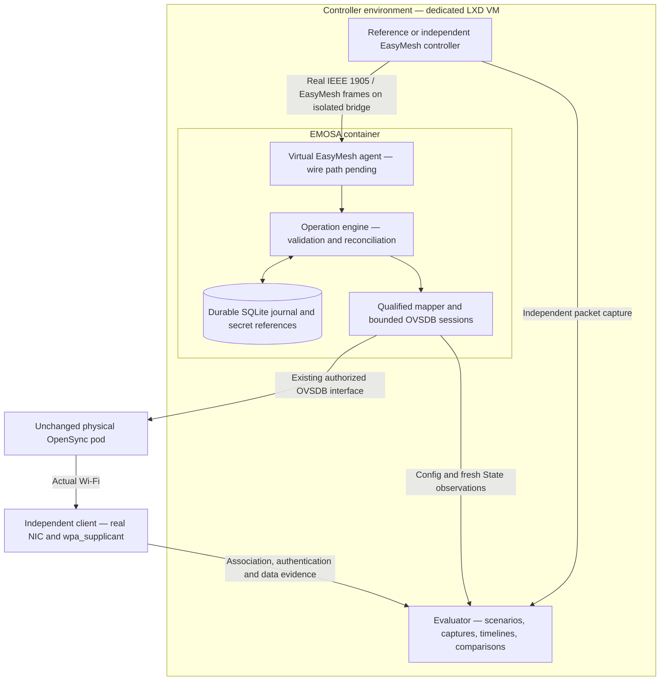
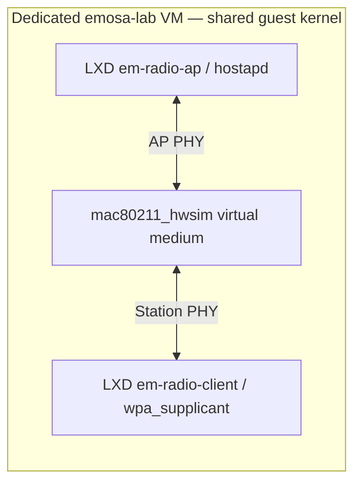

# EMOSA architecture

The target is a controller-side adapter that lets a real EasyMesh controller
manage an unchanged OpenSync pod through its existing OVSDB interface. New code
runs outside the pod. The controller must discover and onboard the OpenSync
extender as an EasyMesh agent represented by EMOSA. The pod remains an OpenSync
device; its agent/radio/BSS identities and advertised capabilities must be backed
by the actual qualified pod mapping. Qualification and evidence determine which
procedures work.

[Open the interactive explorer](https://boardfarmdevs.github.io/emosa/#architecture)
or [download the standalone diagram](../site/architecture.svg).

The diagram describes the intended acceptance path. The semantic operation
engine, journal, OVSDB simulator and evaluation tools are implemented. The real
wire agent, physical mapping and independent-controller path remain gated.

| Building block | Responsibility | Current evidence |
| --- | --- | --- |
| Reference controller / independent peer | Originate actual protocol messages | P0/I3/I4 pending |
| Virtual agent | Terminate selected EasyMesh procedures and bind the complete request | Normative research; implementation pending |
| Operation engine | Validate, guard, serialize, track deadlines and reconcile | Model and OVSDB component tests |
| Journal / secret mechanism | Preserve operations and attribution through restart | SQLite and private-secret tests |
| OVSDB mapper / session | Schema, resource bindings, guarded Config patches, fresh State | Real server and separate manager simulator |
| Existing pod managers and radio | Apply configuration without added pod software | Actual M0 qualification pending |
| Independent client | Observe authentication, connectivity and recovery | Standalone hwsim smoke passed; physical client pending |
| Evaluator | Preserve inputs, outcomes, failures, comparisons and artifact hashes | Retained component runs |

## Optional radio lab

The radio harness is a standalone Linux Wi-Fi smoke test. It is not currently
connected to the EMOSA OVSDB manager simulator. To integrate it, a separate lab
manager must translate accepted Config into hostapd configuration and publish
State only from actual daemon/driver observations. Client results must remain an
independent evidence source. That integration must not substitute synthetic
State for an actual association or data-path observation.

For physical pods, the station needs a real Wi-Fi NIC reachable through the
dedicated VM/container (or a separate independent client). hwsim simulates
radios; it cannot associate over RF with the pod. No firmware or new software is
installed on the physical pod. See the [radio manual](../deploy/hwsim/README.md).

The layout follows the project's
[architecture requirements](../doc/minimal-easymesh-architecture-requirements.md).
Radio behavior is grounded in the kernel's
[mac80211_hwsim documentation](https://wireless.docs.kernel.org/en/latest/en/users/drivers/mac80211_hwsim.html)
and the upstream [wpa_supplicant documentation](https://w1.fi/wpa_supplicant/).
