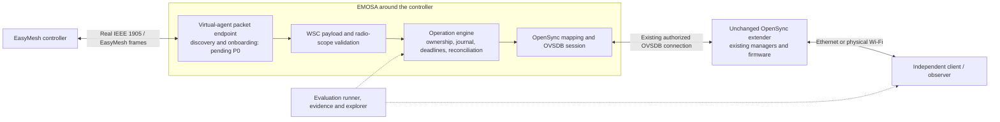
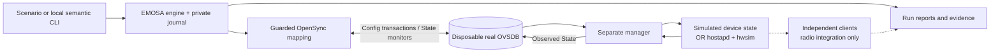
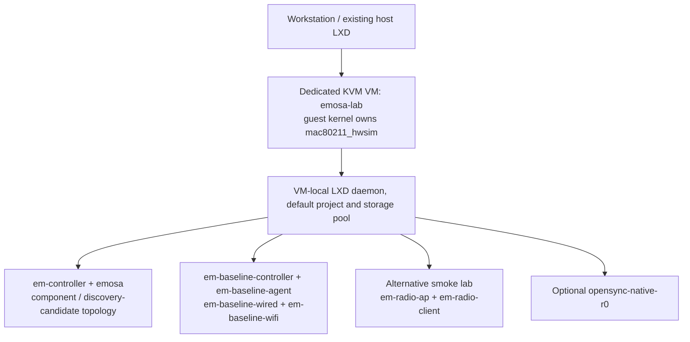

# EMOSA Lab: team onboarding, operation and demonstration manual

**Audience:** new developers, test engineers, lab operators and demo presenters.

**Reference date:** 2026-09-16. Commands describe the implementation in this checkout.

**Start here:** complete chapters 1–6 before using a shared radio lab.

EMOSA means **EasyMesh to OpenSync Adapter**. OVSDB is the current OpenSync
management interface used by the adapter. EMOSA Lab is the platform for developing
and evaluating that adapter. The objective is for an EasyMesh controller to
discover and onboard an **unchanged OpenSync extender**, represented as an
EasyMesh agent by EMOSA running around the controller. The final proof requires:

**Real EasyMesh messages → EMOSA adapter → unchanged physical OpenSync pod →
independently observed behavior.**

That complete path is still pending. This manual teaches the working components,
the available experiments and the exact boundaries of their evidence. Running
every available component successfully does not automatically complete that path.

## Contents

1. [Choose a learning path](#1-choose-a-learning-path)
2. [Understand the architecture and vocabulary](#2-understand-the-architecture-and-vocabulary)
3. [Set up a developer checkout](#3-set-up-a-developer-checkout)
4. [Run the model and learn to read a result](#4-run-the-model-and-learn-to-read-a-result)
5. [Build and exercise the real OVSDB simulator](#5-build-and-exercise-the-real-ovsdb-simulator)
6. [Use the long-running adapter and every local CLI operation](#6-use-the-long-running-adapter-and-every-local-cli-operation)
7. [Explore evidence and the GitHub Pages manual](#7-explore-evidence-and-the-github-pages-manual)
8. [Establish the dedicated LXD environment](#8-establish-the-dedicated-lxd-environment)
9. [Run the standalone wireless smoke test](#9-run-the-standalone-wireless-smoke-test)
10. [Prepare and run native controller–agent onboarding](#10-prepare-and-run-native-controlleragent-onboarding)
11. [Run EMOSA through OVSDB to hwsim and real clients](#11-run-emosa-through-ovsdb-to-hwsim-and-real-clients)
12. [Use the controller discovery candidate](#12-use-the-controller-discovery-candidate)
13. [Exercise WSC components and native OpenSync research](#13-exercise-wsc-components-and-native-opensync-research)
14. [Prepare an unchanged physical pod for read-only qualification](#14-prepare-an-unchanged-physical-pod-for-read-only-qualification)
15. [Deliver a demonstration](#15-deliver-a-demonstration)
16. [Troubleshoot, recover and retain evidence](#16-troubleshoot-recover-and-retain-evidence)
17. [Develop, validate and publish changes](#17-develop-validate-and-publish-changes)
18. [Complete onboarding and advance the proof](#18-complete-onboarding-and-advance-the-proof)

## 1. Choose a learning path

### 1.1 What you can run today

| Capability | Where to run | What a successful result establishes | What remains outside that result |
| --- | --- | --- | --- |
| Deterministic model scenarios | Linux development checkout | Operation lifecycle, fault expectations, journal and evaluator behavior | Actual OVSDB, Wi-Fi, EasyMesh and pods |
| Real OVSDB simulator | Same checkout; local C build | Real upstream database protocol, schema monitoring, guarded Config changes and separately simulated State | Radio actuation and EasyMesh |
| Long-running adapter/local API | Same checkout plus teaching fixture | Inventory, planning, semantic submission, idempotency, waiting, quiescing and service restart | A live EasyMesh controller |
| Static explorer | Browser, or local HTTP server | Inspection of retained, reviewed evidence | Live execution; the website has no lab connection |
| Standalone hwsim smoke | Dedicated VM and two nested containers | Linux WPA2 association and interface-bound traffic | EMOSA or OVSDB actuation |
| Native controller–agent baseline | Dedicated VM and four nested containers | Wired/wireless onboarding and recovery for the named patched prplMesh tuple | EMOSA, OpenSync, universal onboarding or certification |
| EMOSA/OVSDB/radio integration | Prepared four-container lab | Semantic changes cause independently observed hostapd/hwsim behavior and client outcomes | EasyMesh initiation, native OpenSync firmware or physical RF |
| Controller discovery candidate | Separate prepared peer topology | Native controller discovery frames reach the EMOSA container | An EMOSA response or controller-visible virtual agent |
| WSC crypto/M1/M2/radio admission components | Development checkout | Bounded authenticated payload processing and admission checks | Complete IEEE 1905 framing, exchange binding or write authorization |
| Native OpenSync R0 investigation | Separate VM container | Native manager consumes Config and emits State with dummy-driver feedback | Qualified application backend; database-restart recovery currently fails |
| Read-only pod collector | Machine with private authorized pod access | Actual schema and available identity/inventory facts in a draft profile | Permission to write, mapping qualification or physical acceptance |

There is no `hwsim` backend option to `emosa-lab run`. Chapter 11 uses a separate
integration harness. The advertised `hardware` and `opensync-native` CLI choices
produce blocked runs until their qualification gates are implemented and satisfied.
The `--target` argument is currently a placeholder; it does not load a qualified
pod profile or grant access.

### 1.2 Suggested first week

| Session | Work | Deliverable |
| --- | --- | --- |
| First hour | Chapters 2–4 and browser tour in chapter 7 | Explain the architecture; produce and interpret a model run |
| First half day | Chapters 5–6 | OVSDB baseline/fault results; show a planned and observed operation through the service |
| Lab orientation | Chapter 8 and one of 9–11 with the lab owner | Draw the actual topology and locate independent client evidence |
| Protocol/development orientation | Chapters 12–14 and 17 | Identify P0/M0/R0/X1 and trace one feature from contract to evidence |
| Demo rehearsal | Chapter 15 | Deliver a scoped demo and explain one failure without concealing it |
| Handover | Chapter 18 | Completed competency checklist and a reviewed next task |

Model/OVSDB work needs no LXD, host networking changes or physical pod. Reserve
the dedicated radio lab with its operator before changing its experiment mode.

### 1.3 Command conventions

Commands use **Bash on Linux**. `HOST` means the development/LXD host; `VM` means
root inside the dedicated `emosa-lab` VM; `CONTAINER` means the named inner LXD
container. Unless a paragraph says otherwise, run commands from the repository
root on HOST. Do not paste VM package/network commands into the workstation shell.

Use three terminals for chapter 6, all in the same checkout. Shell variables
belong to the terminal that set them; repeat the stated initialization in a new
terminal. Replace `RUN_ID`, `OPERATION_ID`, `RUN_A`, `RUN_B` and `LABEL` only where
the instructions explicitly use placeholders. Run IDs are generated by the tool;
lab labels must be unique. Never overwrite a failed trial to make a rerun pass.

## 2. Understand the architecture and vocabulary

### 2.1 The intended system



The OpenSync extender does not gain an EasyMesh daemon or new firmware. EMOSA
must represent its actual qualified resources to the controller and translate
only supported requests into existing OpenSync configuration. A controller
inventory entry and an OVSDB acknowledgement alone are insufficient: the
represented radio/BSS and independently observed behavior must agree.

### 2.2 The working component path



The regular OVSDB simulator manager publishes **synthetic** State. The separate
radio integration manager reads live hostapd and nl80211 before publishing State.
Both are test infrastructure. Neither is the firmware in an actual OpenSync pod.

### 2.3 Terms you will see

| Term | Meaning in this repository |
| --- | --- |
| Controller | The EasyMesh orchestration peer; the bundled `em-controller` CLI currently reports a blocked wire gate |
| Agent / virtual agent | A native EasyMesh device, or the intended EMOSA representation of an OpenSync pod; a semantic test pod is not a discovered agent |
| AL MAC | IEEE 1905 abstraction-layer identity; distinct from individual interface/BSSID identities |
| Radio / PHY | Wireless hardware or a kernel hwsim radio; may host several interfaces |
| VIF / BSS / BSSID | Virtual interface / wireless network instance / its MAC identity; an SSID is its network name |
| Fronthaul / backhaul | Client-facing service / connection from an extender toward the controller network |
| WPS / WSC | WPS includes wireless enrollment; WSC M1/M2 AP settings also appear within EasyMesh radio provisioning. These are separate exchanges in the native wireless experiment |
| OVSDB Config / State | Desired manager input / manager-reported observation. A Config commit does not establish application |
| Semantic interface | Direct structured intent into EMOSA, bypassing EasyMesh frames; useful for component testing |
| Attribution | Evidence about whether our transaction committed; matching current State cannot identify its writer after a lost reply |
| Freshness / generation | Whether observations are usable and which synchronized OVSDB session they belong to |
| Independent client | A separate traffic probe with a bound data interface and fresh response checks; neither Config nor State is client evidence |
| P0 / M0 / R0 / X1 | Wire/specification readiness / physical mapping qualification / optional native backend qualification / independent-peer acceptance |

### 2.4 Source map

Read [architecture.md](architecture.md) after this overview. For hands-on work:

| Location | Responsibility |
| --- | --- |
| `src/emosa/reconcile.py`, `model.py`, `store.py` | Durable operations, lifecycle, recovery and per-pod serialization |
| `src/emosa/opensync/` | Upstream OVS session, schema decoding and narrow existing-BSS mapping |
| `src/emosa/simulation/` | Disposable databases, separate synthetic manager and radio manager component |
| `src/emosa/app.py`, `cli.py`, `local_api.py` | Adapter service and local Unix-socket commands |
| `src/emosa/evaluation/` | Scenarios, gates, reports, comparisons and LXD routing |
| `src/emosa/wsc*.py` | Bounded payload and radio-request components |
| `schemas/`, `scenarios/`, `tests/` | Versioned contracts, runnable experiments and checks |
| `deploy/` | Dedicated VM, peer, radio, native-manager and qualification workflows |
| `docs/evidence/`, `site/`, `scripts/build-site.py` | Reviewed evidence and static explorer |
| `doc/EMOSA-CODING-HANDOFF.md`, `docs/traceability.json` | Requirements/handoff and implementation/evidence mapping |

## 3. Set up a developer checkout

### 3.1 Prerequisites and versions

Use a Linux account with Git, curl and a Bash shell. The recorded development
host is Ubuntu 22.04; CI and the dedicated VM use Ubuntu 24.04. Native Windows,
macOS, WSL networking and other architectures are not qualified lab deployments.
A browser is sufficient for retained-evidence demonstrations.

The repository pins CPython **3.13.7**, uv **0.11.17** in CI and Open vSwitch
**4.0.0** for the database tools. Python dependencies come from `uv.lock`.
The OpenSync schema is `interfaces/opensync.ovsschema` from
`plume-design/opensync` commit
`78d8a7194d5e77635877cc456231e7be5cf03d68`, already retained under
`tests/fixtures/opensync/` with provenance and license. No OpenSync checkout is
needed for model/OVSDB work. This schema is an upstream simulation reference,
not a qualified profile of our physical pods.

### 3.2 Install the selected uv and clone

If uv is absent, use the versioned official installer. It installs into your
account; it does not install system Python. You may inspect the downloaded
script before executing it. See [Astral's installation instructions](https://docs.astral.sh/uv/getting-started/installation/).

```bash
curl --fail --location https://astral.sh/uv/0.11.17/install.sh -o /tmp/emosa-uv-install.sh
sh /tmp/emosa-uv-install.sh
export PATH="$HOME/.local/bin:$PATH"
uv --version
git clone https://github.com/boardfarmdevs/emosa-lab.git
cd emosa-lab
git rev-parse HEAD
uv python install 3.13.7
uv sync --frozen
uv run python --version
```

Expected: uv 0.11.17, Python 3.13.7 and a project `.venv`. If the checkout already
exists, enter it and inspect `git status --short`; do not clone over it. Do not
regenerate the lockfile to work around a failed download. Resolve the dependency
or network error first. Internet is needed for initial downloads; offline use
requires the selected dependencies and source artifacts to be retained locally.

### 3.3 Verify the basic installation

```bash
uv run emosa --help
uv run emosa-lab --help
uv run em-controller status --json
uv run ruff check .
uv run ruff format --check .
uv run pytest -m unit
```

`em-controller status` should report `protocol_state: blocked`, gate `P0`, and
empty `wire_procedures`/`virtual_agents`. That is the implemented status, not an
installation failure. The retained pre-manual revision had 175 unit-suite and
14 OVSDB-suite passes; counts can evolve and overlap. Compare with CI for your
revision, not a sum interpreted as independent acceptance cases.

### 3.4 Create a private local workspace

```bash
umask 077
mkdir -p .lab/team-manual
chmod 700 .lab/team-manual
```

`.lab/` and `.cache/` are ignored. Keep raw runs private anyway: ignored files
can still be exposed by copying a directory or serving it over HTTP. Real pod
configuration and secrets belong **outside** the checkout; chapter 14 gives the
paths. Never serve the repository root as a demo website.

## 4. Run the model and learn to read a result

### 4.1 Your first run

```bash
uv run emosa-lab --state-dir .lab/team-manual run \
  scenarios/component-bss-change.json --backend model \
  > .lab/team-manual/model-start.json
cat .lab/team-manual/model-start.json
emosa_model_run=$(uv run python -c \
  'import json; print(json.load(open(".lab/team-manual/model-start.json"))["run_id"])')
uv run emosa-lab --state-dir .lab/team-manual report "$emosa_model_run" --format json
```

The `Started run-...` notice goes to stderr. Stdout contains the result summary.
Expect `execution_status: completed`, `verdict: pass`, and
`interoperability_verdict: not_evaluated`. The operation should finish
`OBSERVED_APPLIED`. Its observation provenance remains a synthetic device model.
The model clock is deterministic; its timing is not a measured device latency.

### 4.2 Inspect reports, operations and events

```bash
uv run emosa-lab --state-dir .lab/team-manual report "$emosa_model_run" \
  --format markdown > .lab/team-manual/model-report.md
uv run emosa-lab --state-dir .lab/team-manual report "$emosa_model_run" \
  --format html > .lab/team-manual/model-report.html
uv run emosa-lab --state-dir .lab/team-manual watch "$emosa_model_run" --once
emosa_model_op=$(uv run python -c \
  'import json,sys; print(json.load(open(sys.argv[1]))["operations"][0]["operation_id"])' \
  ".lab/team-manual/runs/$emosa_model_run/run.json")
uv run emosa-lab --state-dir .lab/team-manual inspect "$emosa_model_run" \
  --operation "$emosa_model_op"
```

Open the HTML report locally in a browser. `report` prints a representation; it
does not open a browser. `inspect` returns the selected operation, related timeline
and artifact references. A run ID from another state directory is not found;
always use the same `--state-dir`, placed **before** the subcommand.

For a live view, start a run in terminal A, copy its immediately printed run ID
and use terminal B:

```bash
uv run emosa-lab --state-dir .lab/team-manual watch RUN_ID --timeout 60
```

This emits JSON events/status until the run completes or the watch deadline
expires. A watch timeout does not cancel the experiment. Finished short runs are
still inspectable. JSON output may comprise multiple objects for `watch` or
`--repeat`; do not feed that stream to a single `json.load()`.

### 4.3 Understand operation and experiment outcomes

| Field/state | How to explain it |
| --- | --- |
| `REQUESTED`, `VALIDATED`, `SUBMITTED` | Intent recorded, admitted, then handed to a backend; not yet proof of application |
| `CONFIG_COMMITTED` | A validated database response established the desired Config change |
| `INDETERMINATE` | Submission outcome is unknown; reconciliation must use fresh evidence |
| `OBSERVED_APPLIED` | The qualified observation predicate currently matches; check deadline, provenance and client scope |
| `TIMED_OUT` | Application missed its deadline; late observation cannot convert the original outcome into timely success |
| `OWNERSHIP_CONFLICT` | Guard/current-state evidence indicates interference; automatic resubmission is blocked |
| `REJECTED`, `FAILED`, `CANCELLED` | Admission/execution/cancellation result; inspect reason and attempt evidence |
| Run `verdict: pass` | The **scenario's expectation** passed. A fault scenario can correctly expect `TIMED_OUT` |
| `interoperability_verdict: not_evaluated` | No interoperability conclusion was attempted |
| `verdict: blocked` | Required inputs, backend or evidence are unavailable; no substitute execution establishes the missing proof |

Read the report in this order: backend and initiating interface → prerequisites
and limitations → expected/actual checks → operation attempts and attribution →
observed State → separate client result → cleanup. This prevents a green test
result from being mistaken for successful physical provisioning.

### 4.4 Rerun, parameterize and compare

```bash
uv run emosa-lab --state-dir .lab/team-manual run \
  scenarios/component-bss-change.json --backend model \
  --ssid emosa-training-b --seed 23 --repeat 2 --apply-seconds 5
uv run emosa-lab --state-dir .lab/team-manual compare RUN_A RUN_B --format json
uv run emosa-lab --state-dir .lab/team-manual compare RUN_A RUN_B \
  --format html > .lab/team-manual/comparison.html
```

Use the two returned IDs for `RUN_A`/`RUN_B`. Every repetition creates a new run.
Allowed repetitions are 1–100. The seed controls simulated choices, **not**
credentials, UUIDs or OS scheduling. `--apply-seconds` changes the application
deadline; the scenario's overall deadline is separate. Comparisons expose input,
outcome and timing differences; comparing model and real-time OVSDB runs does not
measure their relative hardware performance.

## 5. Build and exercise the real OVSDB simulator

### 5.1 Build only the database tools

The build requires curl, tar, a C compiler, make, libc headers and pkg-config.
On an Ubuntu development machine where you administer packages, the conventional
prerequisites are:

```bash
sudo apt-get update
sudo apt-get install -y build-essential pkg-config curl
```

Skip package installation when these already exist. Run the actual repository
build as your normal user:

```bash
bash scripts/build-ovsdb.sh
uv run pytest -m ovsdb
```

The script verifies the release archive's SHA-256, builds Open vSwitch 4.0.0
`ovsdb-server` and `ovsdb-tool` under `.cache/upstream/`, and prints versions and
binary hashes. It performs no system install and starts no switch datapath.
`configure-emosa.log`, `generated-emosa.log` and `build-emosa.log` in that build
directory explain failures. `EMOSA_BUILD_JOBS=2 bash scripts/build-ovsdb.sh`
reduces concurrent compiler work on a small machine.

If using separately retained tools, set `EMOSA_OVS_BIN` to the directory containing
both executables and record their versions/hashes. The override is searched first;
the source-tree build and PATH are fallbacks. Verify the chosen tools explicitly
instead of assuming a system OVS package matches the reference. This build disables
server TLS for local simulation; the separately installed Python OVS client handles
the qualified collector's TLS connection path.

### 5.2 Run the normal and lost-reply experiments

```bash
uv run emosa-lab --state-dir .lab/team-manual run \
  scenarios/component-bss-change.json --backend ovsdb-sim
uv run emosa-lab --state-dir .lab/team-manual run \
  scenarios/component-lost-reply.json --backend ovsdb-sim
```

Inspect both using chapter 4. Both should pass with `OBSERVED_APPLIED`. The
normal case records commit attribution `reply`. The lost-reply case records
`unknown`, reconnects/reconciles and retains a single submission attempt. The
injection discards a real reply at adapter ingress; it does not prove loss on a
physical network. A current matching condition cannot establish who committed it.

### 5.3 Complete scenario catalog

All nine semantic scenarios below can run with `model` or `ovsdb-sim`:

| File under `scenarios/` | Exercise | Expected outcome for the affected pod |
| --- | --- | --- |
| `component-bss-change.json` | Existing AP SSID/PSK change | `OBSERVED_APPLIED`, attribution `reply` |
| `component-lost-reply.json` | Lose the commit response | `OBSERVED_APPLIED`, attribution `unknown` |
| `application-rejection.json` | Simulated device refuses application after Config commits | `TIMED_OUT`, attribution `reply` |
| `partial-application.json` | Only part of the desired settings reaches State | `TIMED_OUT`, attribution `reply` |
| `competing-writer.json` | Another simulated writer changes managed Config | `OWNERSHIP_CONFLICT`, attribution `reply` |
| `stale-precondition.json` | Managed state changes before the transaction guard | `OWNERSHIP_CONFLICT`, attribution `unknown` |
| `controller-restart.json` | Reconstruct engine/journal during reconciliation | `OBSERVED_APPLIED`; this is not a native EasyMesh controller restart |
| `server-restart.json` | Restart disposable database and manager, resynchronize | `OBSERVED_APPLIED`; inspect session generation |
| `multi-pod-isolation.json` | Withhold one of four simulated pods | `pod-1` times out; the other three apply |

Run them all without discarding failures:

```bash
emosa_suite_status=0
for emosa_scenario in component-bss-change component-lost-reply application-rejection \
  partial-application competing-writer stale-precondition controller-restart \
  server-restart multi-pod-isolation; do
  if uv run emosa-lab --state-dir .lab/team-manual run \
    "scenarios/$emosa_scenario.json" --backend ovsdb-sim; then
    :
  else
    emosa_suite_status=1
  fi
done
test "$emosa_suite_status" -eq 0
```

Use `--backend model` to repeat the same catalog without native processes. Each
run is independent and disposes its own simulation resources. This loop is a
component exercise, not the native 14-case onboarding suite.

### 5.4 Show a blocked genuine-wire request

`provision-one-bss.json` and `lost-reply.json` request `easymesh-wire` and packet
evidence. They are intentionally different from their `component-*` counterparts.

```bash
uv run emosa-lab --state-dir .lab/team-manual run \
  scenarios/provision-one-bss.json --backend ovsdb-sim
```

Expect exit **5**, a retained blocked run and missing P0/packet-evidence gates.
This is a useful demo of honest admission. Do not edit its initiating interface
to semantic and call the new result a wire pass. Likewise, `--backend hardware`
and `--backend opensync-native` report their qualification gates.

### 5.5 Customize an experiment

1. Copy an appropriate semantic scenario to `.lab/team-manual/my-scenario.json`.
2. Change `id`, `purpose`, intent, deadlines or a supported fault boundary.
3. Keep `target_allowlist`, requirements and expected state/attribution honest.
4. Use `cleanup: dispose-simulation`. Keep only evidence this backend can produce.
5. Validate, then run with a new result directory generated by the evaluator:

```bash
uv run python -c 'from emosa.config import load; load("scenario", ".lab/team-manual/my-scenario.json"); print("Scenario shape valid")'
uv run emosa-lab --state-dir .lab/team-manual run \
  .lab/team-manual/my-scenario.json --backend ovsdb-sim
```

`schema_version` is 1. Unknown properties are rejected. The fault action must
match its implemented point; the catalog shows supported combinations. Declaring
`pcap` or `independent-client` on the ordinary component backend blocks the run
because that backend cannot produce it. Schema validation checks document shape;
runtime gates still decide whether the experiment can execute.

## 6. Use the long-running adapter and every local CLI operation

The scenario runner owns a short-lived engine. This chapter instead starts
`emosa serve` and uses its Unix-socket API interactively. The accompanying
[local-simulator.py](../examples/team-manual/local-simulator.py) creates a disposable
database, runs the existing independent synthetic manager and writes a validated
adapter configuration plus a sample intent. Its generated PSK is synthetic and
private; no endpoint or credential from a real pod is used.

### 6.1 Terminal A: start the teaching fixture

Complete chapter 5 first. From the checkout:

```bash
uv run python examples/team-manual/local-simulator.py --directory .lab/manual-service
```

Wait for `Fixture ready`. Leave it running. The directory must be new; for another
exercise choose `.lab/manual-service-02` and use that path consistently below.
The fixture does not start the adapter itself. It applies simulated State every
quarter second unless its `withhold` marker exists. This is test scaffolding,
with no radio and no native OpenSync manager.

### 6.2 Terminal B: inspect configuration and start the adapter

```bash
cat .lab/manual-service/adapter.json
cat .lab/manual-service/intent.json
uv run emosa serve --config .lab/manual-service/adapter.json
```

Leave this terminal running. It is normal for the service to remain quiet.
The generated files illustrate the actual loaders:

| Configuration field | Meaning |
| --- | --- |
| `backend_mode: ovsdb-sim` | The admitted local simulation mapping |
| `state_directory` | Durable SQLite journal and single-process lock |
| `secret_directory` | Owned mode-0700 directory containing private secret files and fingerprint key |
| `socket_path` | Mode-0600 local API socket; clients must use this same path |
| `write_mode: managed-fields` | Allow the bounded simulator modification path; `read-only` rejects submissions |
| `request_source` | Server-assigned source used in idempotency scope |
| `pods[]` | Explicit pod ID, database endpoint, radio/VIF names and logical radio/BSS IDs |
| Optional `limits` | Local frame/client and OVSDB request bounds; see `schemas/config.schema.json` |

The editable intent contains `pod_id`, `radio_id`, `bss_id`, `ssid`, `secret_ref`,
`enabled: true`, and `security_mode: wpa2-psk`. Current mapping supports an
**existing enabled WPA2 AP**, changing only SSID and the selected PSK map entry.
It preserves unrelated entries, such as the simulator guest key. It does not
create/delete BSSs, change channels or implement arbitrary security modes.

Do not replace the fixture endpoint with a pod endpoint. Physical configuration
uses a separate read-only qualification loader and still cannot enable writes.
The model service backend has no autonomous device actuator; use the model
scenario runner for model application, or this OVSDB fixture for service exercises.

### 6.3 Terminal C: inspect readiness, capabilities and inventory

Set the socket in every client terminal:

```bash
emosa_socket="$PWD/.lab/manual-service/control.sock"
uv run emosa --socket "$emosa_socket" status --json
uv run emosa --socket "$emosa_socket" pods --json
uv run emosa --socket "$emosa_socket" pod pod-1 capabilities --json
uv run emosa --socket "$emosa_socket" pod pod-1 radios --json
uv run emosa --socket "$emosa_socket" pod pod-1 bsses --json
uv run emosa --socket "$emosa_socket" pod pod-1 clients --json
uv run emosa --socket "$emosa_socket" ownership status --pod pod-1
```

Wait for `ready: true` before submitting. The BSS initially uses `initial-network`;
the simulated client inventory is empty. An empty client list is not a failed
wireless association here: this fixture has no station. Ownership scope is
`simulation only`; protocol state remains blocked despite database readiness.
`--json` is accepted by the listed views; CLI output is JSON by default too.

### 6.4 Plan, submit and inspect a change

```bash
uv run emosa --socket "$emosa_socket" plan \
  --intent-file .lab/manual-service/intent.json
uv run emosa --socket "$emosa_socket" component-submit \
  --intent-file .lab/manual-service/intent.json \
  --idempotency-key manual-change-1 --run-id manual-session \
  --apply-seconds 10 --wait 10 > .lab/manual-service/submit.json
cat .lab/manual-service/submit.json
emosa_service_op=$(uv run python -c \
  'import json; print(json.load(open(".lab/manual-service/submit.json"))["operation_id"])')
uv run emosa --socket "$emosa_socket" operation show "$emosa_service_op" --json
uv run emosa --socket "$emosa_socket" operation wait "$emosa_service_op" --timeout 10
uv run emosa --socket "$emosa_socket" events --run-id manual-session --after 0 --limit 100
uv run emosa --socket "$emosa_socket" pod pod-1 bsses --json
```

`plan` checks admission and describes the fields/guard without submitting a
Config transaction. `component-submit` should end `OBSERVED_APPLIED`, with one
attempt and the new SSID. Neither command passes through EasyMesh. The service's
`--run-id` is an event correlation label; it does **not** create an evaluator
run directory. Use `emosa operation/events` for this journal, not `emosa-lab report`.

### 6.5 Verify idempotency and observed no-op

Repeat the exact `component-submit` command with `manual-change-1`. It must return
the same operation ID and retain one attempt. The scope combines request source,
pod and idempotency key. Reusing that key for a different intent is an input error.

Submit the same unchanged intent with `--idempotency-key manual-change-2`. The
engine can recognize the already satisfied target without an unnecessary Config
write; inspect `changed` and `attempts`. Idempotent redelivery and observed no-op
are different cases: the former finds an existing request, the latter admits a
new request against current observations.

### 6.6 Demonstrate caller timeout, application timeout and late evidence

In terminal C, with terminal A and B still running:

```bash
touch .lab/manual-service/withhold
sleep 1
uv run python - <<'PY'
import json
from pathlib import Path
p = Path('.lab/manual-service/intent.json')
intent = json.loads(p.read_text())
intent['ssid'] = 'emosa-team-delayed'
Path('.lab/manual-service/delayed-intent.json').write_text(json.dumps(intent, indent=2))
PY
uv run emosa --socket "$emosa_socket" component-submit \
  --intent-file .lab/manual-service/delayed-intent.json \
  --idempotency-key manual-delayed-1 --run-id manual-session \
  --apply-seconds 3 > .lab/manual-service/delayed-submit.json
emosa_delayed_op=$(uv run python -c \
  'import json; print(json.load(open(".lab/manual-service/delayed-submit.json"))["operation_id"])')
uv run emosa --socket "$emosa_socket" operation wait "$emosa_delayed_op" --timeout 1
uv run emosa --socket "$emosa_socket" operation wait "$emosa_delayed_op" --timeout 5
```

Run the last two commands promptly. The first normally exits **3** because the
caller's one-second wait expired; the operation continues. If you pause long
enough before running it, the three-second application deadline may already have
expired. The second returns the terminal `TIMED_OUT` operation. Importantly,
`operation wait` can exit **0** for a `TIMED_OUT` result: inspect the state and
deadline fields instead of treating shell success as application success.

Now remove only the marker created by this exercise:

```bash
rm .lab/manual-service/withhold
uv run emosa --socket "$emosa_socket" operation show "$emosa_delayed_op"
uv run emosa --socket "$emosa_socket" pod pod-1 bsses --json
```

Repeat the two reads after the next manager/reconciliation cycle. The SSID will
apply, but the operation retains `TIMED_OUT`, its original outcome and
`late_resolution: applied_after_deadline`. `operation wait` on an already terminal
operation returns immediately; it does not wait for late resolution.

### 6.7 Cancellation, ownership and bounded concurrency

The CLI syntax is:

```bash
uv run emosa --socket "$emosa_socket" operation cancel OPERATION_ID
```

Cancellation is allowed only by the operation transition rules, before backend
submission. A normal local request often submits before an operator can cancel
it. Cancelling an already submitted/committed/terminal operation is rejected;
there is no automatic undo or stale-snapshot restoration. Use the completed
`$emosa_service_op` to observe that rejection, not to demonstrate rollback.

Only one modifying operation per pod may be active; there is no waiting queue.
A different request while the pod is busy is rejected. Other pods can progress.
Use chapter 5's multi-pod and competing-writer experiments for deterministic
coverage rather than trying to win a timing race at the CLI. A durable ownership
conflict requires establishing actual writer control before proceeding; the
service has no `clear-conflict` shortcut.

### 6.8 Quiesce, restart and shut down

```bash
uv run emosa --socket "$emosa_socket" quiesce --json
uv run emosa --socket "$emosa_socket" status --json
```

Quiescing prevents new work while existing operations continue being observed.
It does not restore pod configuration. There is no resume command; restart the
service deliberately to reopen it. In terminal B press Ctrl-C, leave fixture A
running, then rerun the same `emosa serve --config ...` command. In C inspect the
old operation ID and current inventory: the journal remains, and the existing
database is synchronized again. An interrupted `SUBMITTED` operation is recovered
as indeterminate and reconciled using fresh evidence.

To finish, quiesce, stop B with Ctrl-C, then stop A with Ctrl-C. The fixture stops
its manager/server and removes the disposable database. Generated configuration,
secrets and the adapter journal remain in `.lab/manual-service`. Its database
endpoint is no longer usable: use a new fixture directory next time. Preserve
the journal together with its private secret files and `.fingerprint-key` when
investigating recovery; missing secrets can prevent equality checks/resubmission.

### 6.9 Local API and systemd reference

The local API is newline-delimited, versioned JSON over a private Unix socket,
not HTTP. The CLI supplies a correlated `request_id`. Integrators should read
[local-api.schema.json](../schemas/local-api.schema.json) and use
`emosa.local_api.request`; do not expose the socket as a network control service.
Use event `sequence` values with `--after` to page without replaying the full log.
Defaults are 64 KiB frames, 16 local clients and 16 OVS requests/session;
configuration permits bounded changes, not unlimited buffers.

For a long-lived service inside an application container,
[emosa.service](../deploy/systemd/emosa.service) expects an `emosa` user/group,
`/opt/emosa/.venv`, `/etc/emosa/adapter.json`, writable `/var/lib/emosa` and
`/run/emosa`, and private readable `/run/emosa-secrets`. Prepare those paths and
validate the config before installing/enabling the unit. Pre-create its
`.fingerprint-key` and secret files as the service user because the unit mounts
the secret directory read-only. A privileged process should not generate files
then leave them unreadable to `emosa`. The unit does not launch a simulator manager,
database, radio or wire controller. The three-terminal exercise is the supported
self-contained starting point; a supervised deployment needs separately managed
backend lifecycle and restart qualification.

## 7. Explore evidence and the GitHub Pages manual

Open [the published explorer](https://boardfarmdevs.github.io/emosa-lab/).
No credentials or lab connection are needed.

1. Read **Overview**, including the zero physical-pod proof count and build revision.
2. In **Architecture**, select each building block. Explain who sends Config,
   who produces State and where independent client evidence originates.
3. In **Lab manual**, select Model, OVSDB, hwsim, Native peers and Physical pod.
   Each mode states its prerequisites, commands, scope and limits. Copy commands
   to the correct local terminal; clicking a mode does not run an experiment.
4. In **Evidence explorer**, select the retained baseline, then the lost-reply
   run. Compare their attribution and event sequences. Select the short-deadline
   failure and blocked wire run as well. Search the timeline for `timeout` or
   `commit`; clear the filter to restore all events.
5. In **Path to viability**, read the acceptance gates and searchable requirement
   traceability. Follow evidence links before interpreting a row as complete.
6. In **Reference library**, search for this team manual, radio integration or
   native baseline. These links open checked-in documents and reviewed artifacts.

The six timeline runs are retained component examples, not a live list of your
`.lab/runs`. New radio/native evidence is linked through its reports and reference
cards; it is not silently reclassified as one of those component timelines.
The site is keyboard navigable. On a narrow screen use the same section links
and mode controls; commands can be copied rather than read horizontally.

To preview locally:

```bash
python3 scripts/build-site.py
python3 -m http.server 8000 --bind 127.0.0.1 --directory dist/site
```

Visit `http://127.0.0.1:8000/`; stop the server with Ctrl-C. Serve only `dist/site`.
The builder verifies an explicit evidence allowlist and hashes; it does not copy
private lab files. Markdown manuals and pcaps are GitHub source links, not files
copied into Pages. GitHub links use the build's source revision; newly added
uncommitted documents become reachable after that revision is pushed and rebuilt.

## 8. Establish the dedicated LXD environment

### 8.1 Understand the two LXD levels



The application containers are unprivileged. LXD administration stays in the
VM; no application container receives its daemon socket. Radios are created by
the VM kernel and moved as whole PHYs into the relevant network namespaces.
Physical pods and unrelated host instances are outside this topology.

**Choose one radio owner:** standalone smoke, controller discovery candidate,
or native-baseline/radio-integration topology. They cannot independently load,
unload or reassign the same hwsim module at the same time. The integrated manager
intentionally reuses the native baseline's resources with native services stopped.

### 8.2 Inspect an existing lab first

On HOST:

```bash
lxc --force-local --project default info emosa-lab
lxc --force-local --project default exec emosa-lab -- hostname
lxc --force-local --project default exec emosa-lab -- lxc --force-local --project default list
lxc --force-local --project default exec emosa-lab -- df -h / /opt
```

If it is the prepared shared VM, use chapters 10–11's existing-lab paths with
the operator. Do not run creation scripts against existing names. During the
recorded work, this VM had Ubuntu 24.04, kernel `6.8.0-139-generic`, LXD
`5.21.7-1018661` snap revision `40585`, two CPUs, 2 GiB RAM and a 20 GiB disk.
Builds and retained captures consumed most of that disk. Check space before
staging or running; additional capacity or archived evidence may be needed.
These are recorded resources, not guaranteed minimums for every concurrent build.

Do not stop/reboot a prepared radio VM merely as a readiness check. Radio
assignment after VM/container reboot needs fresh inspection and qualification.

### 8.3 Create a fresh VM

Prerequisites on HOST: an already administered LXD daemon able to run KVM VMs,
appropriate operator access and sufficient storage. This repository does not
bootstrap the workstation's hypervisor or reinitialize a shared daemon. Follow
[Canonical's LXD first steps](https://canonical.com/lxd/docs/latest/tutorial/first_steps/)
if establishing a new host. The commands here assume its local/default context.

On HOST, from a clean committed checkout:

```bash
lxc remote switch local
lxc project switch default
bash deploy/create-vm.sh
mkdir -p .cache
git archive --format=tar --output=.cache/team-source.tar HEAD
lxc file push .cache/team-source.tar emosa-lab/opt/emosa-source.tar
lxc exec emosa-lab -- mkdir -p /opt/emosa
lxc exec emosa-lab -- tar -xf /opt/emosa-source.tar -C /opt/emosa
lxc exec emosa-lab -- bash
```

The final command enters a **VM root shell**. Record `git rev-parse HEAD` on HOST
with the transferred archive's hash. `git archive` copies committed source only;
it excludes `.lab`, `.cache`, secrets and uncommitted work. The VM script refuses
an existing `emosa-lab`; it launches the fingerprint in
[images.lock.json](../deploy/images.lock.json). If that image is no longer served,
obtain the retained base export and verify its digest. Do not silently substitute
today's Ubuntu image. The VM export is not included in Git, and complete prepared
runtime image exports remain pending.

A split container image can be restored into the appropriate daemon using
`lxc image import METADATA_FILE ROOTFS_FILE`; verify both retained file hashes
and the resulting fingerprint before using it. See
[Canonical's image import instructions](https://canonical.com/lxd/docs/latest/howto/images_copy/).
The setup scripts use the `ubuntu:` remote; restoring an image locally does not
rewrite their remote reference. An unavailable remote image may require an
explicitly reviewed setup adjustment to consume the verified local fingerprint.

### 8.4 Initialize only the new VM's daemon

In the fresh VM root shell:

```bash
hostname
systemd-detect-virt --vm
snap list lxd
```

Expected hostname `emosa-lab`, virtualization `kvm`. If LXD is absent, install
the selected revision; if the image already supplies it, inspect its revision
and state before changing anything:

```bash
# Fresh VM only, when LXD is absent:
snap install lxd --revision=40585
snap refresh --hold lxd
snap list lxd
lxd init --minimal
lxc remote switch local
lxc project switch default
lxc storage list
cd /opt/emosa
bash deploy/setup-inner.sh
```

`lxd init --minimal` is for a **new, unused** daemon. It must provide a `default`
storage pool. If the pinned snap revision is unavailable, acquire an authorized
retained artifact or qualify a selected replacement; this manual does not promise
the store retains historical revisions indefinitely. Record package, snap, kernel,
image and storage details for the new execution environment.

`setup-inner.sh` creates `em-controller`, `emosa`, an isolated `em-protocol` bridge
without IP addresses, and a separate `em-mgmt` installation network. Never bridge
`em-protocol` to a pod-facing network. The future packet endpoint is `em0`; the
semantic adapter does not need raw sockets or network administration capability.

### 8.5 Install the Python runtime in the VM and application containers

In the VM, install Git/curl and repeat chapter 3's **selected uv installation**,
then from `/opt/emosa` run `uv python install 3.13.7` and `uv sync --frozen`.
This provides the VM-local evaluation runner and the Python environment reused
by the radio integration. Do not use Ubuntu's default Python for the package.

Still in VM, stage the same committed archive into both fresh containers:

```bash
for emosa_node in em-controller emosa; do
  lxc file push /opt/emosa-source.tar "$emosa_node/opt/emosa-source.tar"
  lxc exec "$emosa_node" -- mkdir -p /opt/emosa /var/lib/emosa/lab
  lxc exec "$emosa_node" -- tar -xf /opt/emosa-source.tar -C /opt/emosa
done
lxc exec em-controller -- bash
```

In that **CONTAINER** root shell:

```bash
apt-get update
apt-get install -y curl build-essential pkg-config
curl --fail --location https://astral.sh/uv/0.11.17/install.sh -o /tmp/emosa-uv-install.sh
sh /tmp/emosa-uv-install.sh
export PATH="$HOME/.local/bin:$PATH"
cd /opt/emosa
uv python install 3.13.7
uv sync --frozen
uv run em-controller status --json
uv run pytest -m unit
exit
```

Back in VM, enter `lxc exec emosa -- bash` and perform the same container setup.
Also run `bash scripts/build-ovsdb.sh` and `uv run pytest -m ovsdb` in the `emosa`
container before exiting. These package commands resolve the available Ubuntu
packages; capture `dpkg-query -W` and compiler/tool versions and repeat validation
for the installed tuple. They are not an exact package-locked runtime image.

### 8.6 Use the VM-local evaluation routing

From `/opt/emosa` **in VM**:

```bash
uv run emosa-lab --execution lxd run \
  scenarios/component-bss-change.json --backend ovsdb-sim
uv run emosa-lab --execution lxd report RUN_ID --format json
uv run emosa-lab --execution lxd watch RUN_ID --once
uv run emosa-lab --execution lxd inspect RUN_ID --operation OPERATION_ID
uv run emosa-lab --execution lxd compare RUN_A RUN_B --format html
```

This checks the bundled controller's status in `em-controller`, pushes the
scenario to `emosa` and runs its installed CLI. Results stay inside `emosa` at
`/var/lib/emosa/lab/runs/`. The routing fixes that state root; a HOST `.lab` or a
local `--state-dir` does not select the remote evidence. Use the same `--execution
lxd` for subsequent queries. Keep the VM LXD client on local/default because
this particular runner inherits its context.

To retain component runs, execute in VM:

```bash
mkdir -p -m 700 /opt/emosa/.lab/container-results
lxc file pull --recursive emosa/var/lib/emosa/lab/runs /opt/emosa/.lab/container-results/
```

Then copy that private directory from VM to private HOST storage with outer
`lxc file pull`. No actual wire controller is started by this component routing.

## 9. Run the standalone wireless smoke test

Use this optional experiment to learn Linux association before the integrated
lab. Skip it if the VM already holds the native-baseline three-radio topology;
chapter 11 exercises the radio path more directly. The full reference is
[deploy/hwsim/README.md](../deploy/hwsim/README.md).

### 9.1 Prepare and run

Inside a dedicated VM with a new initialized inner LXD daemon and no hwsim owner:

```bash
cd /opt/emosa
apt-get update
apt-get install -y python3 iw iproute2 kmod tcpdump
modinfo mac80211_hwsim
```

If the module is absent, install `linux-modules-extra-$(uname -r)` matching the
**running VM kernel**. Record any required reboot and verify the resulting kernel
before radio assignment. Never load this test module on the workstation or pod.

```bash
python3 deploy/hwsim/lab.py check
python3 deploy/hwsim/lab.py setup
python3 deploy/hwsim/lab.py smoke
```

`check` is read-only. `setup` creates `em-radio-ap` and `em-radio-client`, installs
hostapd/wpa_supplicant in them, loads two VM hwsim PHYs and assigns them to the
containers. It creates synthetic credentials through private files and removes
installation Ethernet before testing. It refuses pre-existing resources/module
ownership rather than taking over a running experiment.

### 9.2 Verify and finish

Expect station `wpa_state=COMPLETED`, the intended SSID and WPA2 key management,
three successful pings bound to `wlan0`, and a nonempty virtual-medium capture.
This uses static `192.0.2.1/30` and `192.0.2.2/30`, not DHCP. Inspect the timestamped
directory under `/opt/emosa/.lab/hwsim/` for result, station status, `iw link`, logs,
`wireless.pcap` and artifact hashes. EMOSA/wire/physical fields stay `not_evaluated`.

```bash
python3 deploy/hwsim/lab.py cleanup
```

Cleanup checks ownership before removing its containers/network/profile and
unloading its module; evidence remains. Archive `.lab/hwsim` privately before a
new setup. Another smoke requires a clean fixture, not reuse of existing daemons.
If setup was interrupted or ownership differs, inspect before manual cleanup.

## 10. Prepare and run native controller–agent onboarding

This experiment asks whether the **named native controller and normal native
agent** onboard and forward traffic over wired and wireless backhaul. There is
no EMOSA or OpenSync in their protocol path. It establishes a useful baseline
before inserting EMOSA, not that a controller can always onboard every standard
EasyMesh device. Read the [retained findings](peer-baseline.md) and
[detailed harness reference](../deploy/peer-baseline/README.md).

### 10.1 Acquire the exact inputs before scheduling a fresh build

Use [reference.json](../deploy/peer-baseline/reference.json) and
[prplmesh.reference.json](../deploy/peer/prplmesh.reference.json) as the digest and
provenance sources. Required inputs outside the Python package are:

| Input staged in VM `/opt/peer-artifacts/` | How to obtain / check it |
| --- | --- |
| `prpl-install-nl80211-6.0.0.tar.gz` | Retained companion build or rebuilt candidate; `archives` SHA-256 |
| `prpl-runtime-deps-6.0.0.tar.gz` | Same companion build; `archives` SHA-256 |
| `hostap-runtime-2.10.tar.gz` | Original retained runtime required by setup; `archives` SHA-256 |
| `hostap-source.tar.gz` | Archive the pinned public hostap commit below; `hostap_source_archive_sha256` |
| `prplmesh-patched-source.tar.gz` | Pinned prplMesh source with the companion's 22 patches; `native_hal_overlay.source_archive_sha256` |

The companion source repository is `https://github.com/boardfarmdevs/prplmesh-lab`
at `fcb0b97910e0e9d164578565b970c130d766e88e`; upstream prplMesh is pinned at
`2e153c7e00cbcab6b8ee35082f494a364e23f018`. Use that project's build instructions
for a rebuild. This repository contains the references and extra lab patches,
not a downloadable prepared VM or all those runtime archives. Arrange a verified
artifact handover from the lab operator. A rebuild producing different bytes
requires a reviewed new candidate profile, not editing hashes to skip a failure.

On a source-download machine:

```bash
git clone https://chromium.googlesource.com/external/w1.fi/cgit/hostap hostap-source
git -C hostap-source archive --format=tar.gz --prefix=hostap/ \
  cff80b4f7d3c0a47c052e8187d671710f48939e4 > hostap-source.tar.gz
sha256sum hostap-source.tar.gz
```

Expected digest is in the reference file. Archive metadata matters; source content
equivalence alone does not guarantee an identical compressed archive. Preserve
source licenses with any artifact handover.

### 10.2 Stage and install in a fresh VM topology

Start from chapter 8's VM with `em-mgmt`, `default` storage, the pinned container
image and no competing hwsim owner. Keep `em-controller`, `emosa` and native R0
services stopped during this experiment. Do not rerun setup on an existing
baseline; for that case go to 10.3 after checking ownership and idle services.

Inside VM, source at `/opt/emosa`, after the operator has staged the five archives:

```bash
mkdir -p /opt/emosa-baseline
cp /opt/emosa/deploy/peer-baseline/*.py /opt/emosa-baseline/
cp /opt/emosa/deploy/peer-baseline/reference.json /opt/emosa-baseline/
cp /opt/emosa/deploy/peer-baseline/build-*.sh /opt/emosa-baseline/
cp /opt/emosa/deploy/peer-baseline/patches/*.patch /opt/emosa-baseline/
cp -r /opt/emosa/deploy/peer-baseline/bwl-overlay /opt/emosa-baseline/
cp /opt/emosa/deploy/peer/prplmesh.reference.json /opt/emosa-baseline/
apt-get update
apt-get install -y python3 iw iproute2 kmod tcpdump tshark build-essential \
  libssl-dev libnl-3-dev libnl-genl-3-dev libnl-route-3-dev pkg-config patch cmake
modinfo mac80211_hwsim
python3 /opt/emosa-baseline/setup.py
bash /opt/emosa-baseline/build-hostap.sh
bash /opt/emosa-baseline/build-bwl.sh
python3 /opt/emosa-baseline/manage.py install
```

Builders verify input and output digests. They supply a fixed-layout hostapd
`UPDATE` compatibility patch and a primary-BSS identity fix in native `libbwl`.
No dummy radio backend substitutes for NL80211. A fresh package/toolchain tuple
may need explicit requalification. `--resume` is a builder recovery option for
the same verified tree, not permission to erase a failed build.

Setup owns four unprivileged containers, with three PHYs assigned to the
controller, external agent and wireless client. It removes setup Ethernet from
all four. `setup.py --finish-setup` is only for the recorded completed-package,
pending-radio-assignment state; other interruptions need inspection.

### 10.3 Know the measured data paths

| Node | Data role |
| --- | --- |
| `em-baseline-controller` | Native controller + local native agent; application endpoint `192.0.2.1:8080` on `br-lan` |
| `em-baseline-agent` | External native agent; Ethernet `eth1` or wireless `wlan1` backhaul; LAN `eth2`; AP `wlan0` |
| `em-baseline-wired` | Client `192.0.2.20`, data interface `eth1` behind the external agent |
| `em-baseline-wifi` | wpa_supplicant client `192.0.2.21`, `wlan0`, pinned to agent BSSID `02:00:00:ec:02:00` |

`em-base-bh` supplies the isolated wired backhaul and `em-base-lan` the agent-side
client LAN. In wireless mode the agent's Ethernet backhaul is removed; WPS learns
backhaul credentials from an initially empty supplicant configuration, then the
four-address link carries actual IEEE 1905 discovery/WSC. The endpoint traffic
uses these data paths. LXD exec only starts processes and collects evidence.

Before a prepared run, in VM inspect:

```bash
lxc --force-local --project default list
for emosa_node in em-baseline-controller em-baseline-agent em-baseline-wired em-baseline-wifi; do
  lxc --force-local --project default config get "$emosa_node" user.emosa.baseline
  lxc --force-local --project default exec "$emosa_node" -- ip -brief link
  lxc --force-local --project default exec "$emosa_node" -- \
    systemctl list-units --state=active,activating,deactivating --no-legend \
    'emosa-baseline-*' 'emosa-radio-manager-*'
done
```

Each owner must be `emosa-standard-agent-baseline-v1`. The four containers must
be running, their radios still assigned, and installation `eth0` absent. For a
mode switch from chapter 11, its services must be stopped. The run harness
prepares the selected native topology; do not manually insert backhaul credentials.

### 10.4 Run one clean onboarding in each mode

Inside VM, choose an unused timestamped label:

```bash
emosa_demo_tag=$(date -u +%Y%m%d-%H%M%S)
python3 /opt/emosa-baseline/run.py --mode wired --label "wired-demo-$emosa_demo_tag"
python3 /opt/emosa-baseline/run.py --mode wireless --label "wireless-demo-$emosa_demo_tag"
```

Each measured attempt must show the controller inventory, applied BSS policy,
native agent/fronthaul `OPERATIONAL` state, both independent clients and 30
continuous seconds of healthy state after client checks, followed by fresh
client checks. Inspect the result, not just native process readiness. Separate
120-second bounds apply to controller AP readiness, WPS bootstrap and agent
onboarding/recovery; each client has 30 seconds. They are not a 120-second total
wall-clock limit. Native services remain available after a successful run for
recovery exercises; stop them explicitly when finished.

### 10.5 Run all onboarding, recovery and negative cases

```bash
emosa_suite_tag=$(date -u +%Y%m%d-%H%M%S)
python3 /opt/emosa-baseline/run.py --mode wired --label "wired-suite-$emosa_suite_tag" --suite
python3 /opt/emosa-baseline/negative.py --mode wired --label "wired-negative-$emosa_suite_tag"
python3 /opt/emosa-baseline/run.py --mode wireless --label "wireless-suite-$emosa_suite_tag" --suite
python3 /opt/emosa-baseline/negative.py --mode wireless --label "wireless-negative-$emosa_suite_tag"
python3 /opt/emosa-baseline/manage.py stop --label "stop-$emosa_suite_tag"
```

A suite plans five clean starts, three agent restarts, three managed controller
restarts and three backhaul-loss cases per mode. It stops on the first failed
attempt and retains planned/executed counts. Inspect a failure before starting
the next command. Negative runs check explicit wrong-key rejection, correct-key
reconnection and five rejected unsupported/malformed hostapd updates.

For one recovery from a currently provisioned baseline, use `run.py --mode MODE
--label NEW_LABEL --kind agent-restart`, `controller-restart` or `backhaul-loss`.
The managed controller restart includes its local-agent helper and a transport
readiness barrier. This is part of the tested profile, not arbitrary native
process restart. Outage tests hold the link down for ten seconds, require both
clients to fail, then require 30 continuous healthy seconds **inside** the
120-second recovery limit and another post-client stability check.

The native controller/helper have a known SIGTERM→SIGABRT shutdown defect.
`manage.py stop` may exit nonzero and retains the evidence. Successful functional
recovery does not make that a clean shutdown. Do not hide it with `|| true` or
delete failed attempts. The retained report selects 14 functional cases per
mode plus negative controls, while preserving earlier failures and preliminary
acceptance-version-1 passes that missed a reset loop.

### 10.6 Retain and leave the lab ready for handover

Runs live at VM `/opt/emosa-baseline/runs/LABEL/`; native archives also live in
each owned container at `/opt/emosa-baseline/archive/`. Copy both privately.
From HOST, for the VM run bundle:

```bash
mkdir -p -m 700 .lab/peer-baseline
lxc file pull --recursive --quiet emosa-lab/opt/emosa-baseline/runs .lab/peer-baseline/
```

Use inner `lxc file pull` in VM to collect each node's `archive/` into a distinct
private subdirectory before pulling that directory to HOST. Leave the four
containers running with their services stopped if the next operator will reuse
the assigned PHYs. There is no baseline `cleanup` command; retirement requires
ownership-aware operator cleanup after evidence is retained. Never use the
standalone smoke cleanup script to delete baseline resources.

## 11. Run EMOSA through OVSDB to hwsim and real clients

This is the most direct working demonstration of the **adapter's actuation
boundary**. A semantic EMOSA request changes real OVSDB Config; a separate manager
applies it to hostapd/hwsim, reads the actual daemon/driver and publishes State;
independent wired and wpa_supplicant clients verify traffic. The baseline controller
container serves only an application endpoint in this experiment. Its native
EasyMesh services are stopped.

### 11.1 Prerequisites

1. Prepare chapter 10's four containers, three assigned PHYs and pinned hostap
   runtime. Retain native experiment evidence and stop native services.
2. Keep setup `eth0` absent from all four. Do not run the standalone hwsim lab.
3. Have the VM Python 3.13.7 environment and locked dependencies at
   `/opt/emosa/.venv` from chapter 8.
4. Provide Open vSwitch 4.0.0 tools at VM `/opt/native-ovsdb-server` and
   `/opt/native-ovsdb-tool`. The recorded VM already has these, retained during R0
   preparation; only the database tools are reused, not the native OpenSync manager.
5. Check free disk space, native/radio service state and resource ownership.

For a **fresh** VM missing those two tools, build them in `/opt/emosa` with chapter
5's script, then install copies at the paths expected by staging:

```bash
# VM root, fresh tool paths only; retain existing binaries instead of replacing them.
(
set -eu
cd /opt/emosa
test ! -e /opt/native-ovsdb-server
test ! -e /opt/native-ovsdb-tool
bash scripts/build-ovsdb.sh
install -m 755 .cache/upstream/openvswitch-4.0.0/ovsdb/ovsdb-server /opt/native-ovsdb-server
install -m 755 .cache/upstream/openvswitch-4.0.0/ovsdb/ovsdb-tool /opt/native-ovsdb-tool
sha256sum /opt/native-ovsdb-server /opt/native-ovsdb-tool
)
```

The subshell stops if either tool path already exists. Staging checks version
and records hashes. A new build still requires a measured rerun
and retained provenance; it does not inherit the old VM's qualification by name.
Completing or enabling the failing native R0 backend is not a prerequisite.

### 11.2 Stage and run from HOST

From the current checkout on HOST:

```bash
python3 deploy/radio-manager/stage.py
emosa_radio_label="radio-demo-$(date -u +%Y%m%d-%H%M%S)"
lxc --force-local --project default exec emosa-lab -- env \
  PYTHONPATH=/opt/emosa-radio-manager/source \
  EMOSA_OVS_BIN=/opt/emosa-radio-manager/ovsdb \
  /opt/emosa/.venv/bin/python /opt/emosa-radio-manager/run.py \
  --label "$emosa_radio_label"
```

Staging copies isolated source to `/opt/emosa-radio-manager`, validates the VM,
ownership and idle services, and refuses active run/manager locks. It does not
replace the VM's `/opt/emosa` application tree. Do not stage while an experiment
is running. The label must be unused; retain every failed invocation too.

The harness restores wired backhaul to the AP-side container and removes its
inactive wireless backhaul interface. Its `finally` cleanup stops owned manager,
database, AP, client, endpoint and capture processes, while keeping containers
and PHY assignments running. It leaves the topology in wired mode. Use the native
runner's preparation when switching back to native onboarding.

### 11.3 Follow all 13 cases

| Case | Expected evidence |
| --- | --- |
| `initial` | Initial AP service and both independent clients work |
| `change` | New SSID/key reach actual radio; redelivery retains one operation/write; final synthetic key includes literal quote/backslash characters |
| `withheld` | Config commits while live AP remains unchanged; application times out |
| `late-application` | Later live application retains `TIMED_OUT` and late-resolution evidence |
| `lost-reply` | Fresh observed target satisfies the operation; commit attribution remains unknown with one attempt |
| `wrong-key` | Explicit authentication rejection; correct credentials subsequently recover |
| `unsupported-channel` | Channel 11 request is rejected; live channel remains 6 |
| `adapter-restart` | Engine/backend/journal reconstruction in the runner; this is not a process/container/VM reboot |
| `database-manager-restart` | New OVSDB generation and fresh manager observation; new work applies |
| `backhaul-loss` | Both clients lose reachability even though AP State remains enabled |
| `backhaul-recovery` | Data path and fresh client probes recover |
| `ap-unavailable` | Failed AP observation clears positive State and Wi-Fi client traffic fails |
| `ap-recovery` | Explicit manager restart rebuilds the AP; client checks recover |

The radio profile is one existing BSS, one PSK, 2.4 GHz channel 6, 20 MHz and
WPA2/CCMP. Its SSID subset is narrower than the generic semantic mapper. Applying
configuration restarts the entire hostapd process and interrupts service. There
is no wireless-backhaul, multi-BSS, arbitrary-channel or physical-RF claim here.
Periodic manager reads are not a production freshness lease after an unobserved
manager crash.

Each client has a 30-second budget and must bind its interface/IP, use a fresh
application nonce and receive its own originating address back. Wi-Fi is pinned
to the AP BSSID. Radio/recovery checks allow 30 seconds; operation reconciliation
allows 35 seconds, including its declared application deadline. The withheld case
uses four seconds. The three retained final runs each passed all 13 cases in
roughly one minute, but rehearse on your actual lab before budgeting a live demo.

### 11.4 Inspect and retain the result

On HOST, using the label from 11.2:

```bash
lxc exec emosa-lab -- cat "/opt/emosa-radio-manager/runs/$emosa_radio_label/result.json"
mkdir -p -m 700 .lab/radio-manager
lxc file pull --recursive --quiet \
  emosa-lab/opt/emosa-radio-manager/runs .lab/radio-manager/
```

Review VM `/opt/emosa-radio-manager/runs/LABEL/` (or the copied `runs/LABEL/`):

| Artifact | What to inspect |
| --- | --- |
| `result.json` | Completed status and all 13 case outcomes; absence of wire/physical claims |
| `operations.json` | Deadlines, attempts, attribution, restart and late-resolution semantics |
| `manager.jsonl` | Separate hostapd/nl80211 observations used to publish State |
| `clients-*.json` | Both independently bound clients, unique nonces and originating addresses |
| `radio.pcap`, `eapol.tsv`, packet observations | Four configured SSIDs and WPA EAPOL messages 1–4 in independently decoded capture |
| Topology, source/harness hashes and node logs | Exact resources/build, isolation and failure investigation |

Synthetic private configurations, vault, journal and raw capture stay private.
State enabled during a failed forwarding path is an intentional lesson: always
show the client verdict separately. Read [radio-manager.md](radio-manager.md)
for the retained final selection and earlier attempts. This remains a semantic
radio-boundary proof; it has no EMOSA EasyMesh packet exchange.

## 12. Use the controller discovery candidate

This older, separate topology is useful when working on EMOSA's future packet
endpoint. It is not needed for chapter 11 or the native-agent suite. It uses
`em-controller` and `emosa` on `em-protocol`, with an otherwise down hwsim radio
to satisfy this particular native helper's startup check. No AP/client is started.

1. Use chapter 8's application containers and no competing hwsim owner.
2. Obtain and verify the two prplMesh archives against
   `deploy/peer/prplmesh.reference.json`.
3. Follow [peer preparation](../deploy/peer/README.md#prepare-the-peer) to install
   its runtime packages and archives in the fresh `em-controller` container,
   and copy `controller.py`/`prplmesh.reference.json` to its
   `/opt/emosa/deploy/peer/`. That reference includes the exact installation commands.
4. In VM, attach the radio and start only the owned peer units:

```bash
python3 /opt/emosa/deploy/peer/attach-radio.py
lxc exec em-controller -- python3 /opt/emosa/deploy/peer/controller.py start
lxc exec em-controller -- systemctl show emosa-peer-bus emosa-peer-transport \
  emosa-peer-controller emosa-peer-agent -p Id -p ActiveState -p SubState -p MainPID
lxc exec em-controller -- ubus call Device.WiFi.DataElements.Network _get \
  '{"rel_path":"","depth":1}'
```

5. In VM, use an unused capture directory and observe the independent bridge:

```bash
emosa_capture_dir="/opt/emosa/.lab/discovery-$(date -u +%Y%m%d-%H%M%S)"
mkdir -p -m 700 "$emosa_capture_dir"
timeout --signal=INT 70 tcpdump -i em-protocol -nn -s 0 -c 1 \
  -w "$emosa_capture_dir/controller.pcap" 'ether proto 0x893a'
tshark -r "$emosa_capture_dir/controller.pcap" -T fields \
  -e eth.src -e eth.dst -e ieee1905.message_type
```

Run a second `tcpdump -i em0` inside `emosa` concurrently and compare packet
bytes to verify endpoint delivery; the peer guide gives this observation scope.
A capture timeout or empty file is a failed observation. A decoded native
controller discovery frame does not prove an EMOSA reply or onboarding. The
retained EMOSA-facing controller inventory is empty.

6. Stop the owned peer with:

```bash
lxc exec em-controller -- python3 /opt/emosa/deploy/peer/controller.py stop
```

Inspect and retain the known abnormal shutdown before resetting failed units.
This candidate has no BSS policy by default. A future onboarding test must declare
its complete supported radio policy; an empty policy must not silently become
radio teardown. Actual exchange binding and write admission remain P0 work.

## 13. Exercise WSC components and native OpenSync research

### 13.1 WSC payload implementation and independent vectors

Run these on HOST without a radio or pod:

```bash
uv run pytest tests/test_wsc.py tests/test_wsc_messages.py tests/test_wsc_radio.py
```

The checks cover WPS key derivation/authentication/encrypted settings, exact M1
transcript binding within payload verification, M2 batch authentication, roles,
radio teardown and conservative extraction of a single fronthaul candidate.
Read [wsc-component.md](wsc-component.md), [wsc-messages.md](wsc-messages.md) and
[wsc-radio.md](wsc-radio.md) in that order. The public Python functions and their
synthetic usage examples are in those modules and tests; there is no wire-send CLI.

For an independent implementation cross-check, provide a C compiler and OpenSSL
headers (`build-essential libssl-dev` on Ubuntu), then:

```bash
python3 scripts/check-wsc-reference.py
# Offline, with the exact retained official source archive:
python3 scripts/check-wsc-reference.py --archive /absolute/path/hostapd-2.11.tar.gz
```

Use either invocation, not both unnecessarily. The first downloads the pinned
official source to a temporary directory; both verify digests, compile a test-only
native harness and compare generated bytes to retained vectors. `--fixture wsc`
or `--fixture wsc-messages` selects one part. This uses **hostap 2.11** as a payload
reference, distinct from **hostap 2.10** in the native radio lab. No daemon or
radio is started. Successful vectors establish payload component evidence, not
controller trust, replay protection, complete CMDU validation or interoperability.

### 13.2 Optional native OpenSync R0 investigation

Use [deploy/native/README.md](../deploy/native/README.md) as the full specialized
build runbook. This is a separate C/native investigation, with synthetic dummy
driver feedback, no hwsim requirement and a known database-restart recovery failure.
It is not an `emosa-lab --backend opensync-native` deployment.

Steps for a new investigation:

1. In the dedicated VM, retain other experiments, stop their services and ensure
   memory/storage headroom. From `/opt/emosa`, run `bash deploy/native/prepare.sh`;
   it refuses existing resources and creates `opensync-native-r0`.
2. Copy `deploy/native/` to container `/opt/native/lab/native/`. Inside that
   container run `bash /opt/native/lab/native/install-build-deps.sh`; exact direct
   dependency versions are in `build-deps.lock`. Missing versions are a failure,
   not an instruction to upgrade silently.
3. Archive the exact OpenSync commit with `git archive --format=tar
   78d8a7194d5e77635877cc456231e7be5cf03d68 -o opensync-source.tar` in an upstream
   checkout. Copy it to container `/opt/opensync-source.tar`; the build verifies
   its digest.
4. Supply the selected database binaries in container `/opt/native/ovsdb/` and
   the locked EMOSA Python environment at `/opt/emosa`, as documented in the
   native runbook. The separate native-build Python venv is not the adapter runtime.
5. Inside `opensync-native-r0`, run:

```bash
bash /opt/native/lab/native/build.sh
export EMOSA_NATIVE_ROOT=/opt/native/reproduction
python3 /opt/native/lab/native/check-units.py
/opt/emosa/.venv/bin/python /opt/native/lab/native/check-path.py
```

6. Retain the printed private evidence directory and logs; stop the native
   container after collection. Stop the VM only when no other experiment owns
   running containers/radios and the operator intends to retire those assignments.

Expected current findings: native build and 39 selected upstream units pass;
normal Config reaches the native driver callback and native State; withholding
feedback times out; after database restart, new Config commits but no further
callback/application appears within the probe deadline. The path probe exits
**1**. N03 remains unresolved and the application backend remains disabled.
Fix/requalify reconnect/resubscription or explicit supervisor recovery without
writing synthetic success into State. Earlier failed build attempts remain part
of the history; an old `protoc-c` bootstrap failure is not the current blocker.

## 14. Prepare an unchanged physical pod for read-only qualification

### 14.1 Current status and access preparation

No actual pod endpoint, authentication material or populated private connection
file has been supplied. Direct OVSDB access is reported possible, and competing
cloud writers can reportedly be disabled or redirected, but the concrete lab
setup is unverified. **Pods remain unchanged.** The collector installs nothing,
changes no Config/State, redirects no manager and modifies no firmware.

On the machine/account that will run EMOSA, choose the applicable credentials-free
example:

| Actual existing access | Example |
| --- | --- |
| Mutual TLS | [qualification.example.json](../deploy/qualification.example.json) |
| Authenticated SSH/VPN/etc. tunnel to loopback TCP | [qualification-tunnel.example.json](../deploy/qualification-tunnel.example.json) |
| Owned private local Unix socket | [qualification-unix.example.json](../deploy/qualification-unix.example.json) |

Prepare directories outside the repository, then copy **one** example:

```bash
umask 077
emosa_private_dir="$HOME/.config/emosa/pods/pod-1"
mkdir -p "$emosa_private_dir/secrets" "$emosa_private_dir/sockets"
chmod 700 "$emosa_private_dir" "$emosa_private_dir/secrets" "$emosa_private_dir/sockets"
cp -n deploy/qualification.example.json "$emosa_private_dir/connection.json"
chmod 600 "$emosa_private_dir/connection.json"
```

This does not contact the pod. Locally edit `connection.json` to contain the
actual endpoint/direction/database/pod identity, absolute secret directory, trusted
pin and known expected identifiers. Replace example placeholders. JSON does not
expand `$HOME` or `~`; use actual absolute paths. If EMOSA runs in a container,
these paths must exist inside that container with the CLI user's ownership.

Install existing secret files with mode 0600, no symlinks, owned by the CLI user.
`certificate_ref`, `private_key_ref`, `ca_ref` and tunnel `evidence_ref` are file
**basenames** below `secret_directory`, not credentials or absolute paths.
For mutual TLS obtain the certificate SHA-256 pin through an already trusted
channel; an all-zero example pin is unusable. Keep tunnel credentials with the
tunnel tool; EMOSA does not create or authenticate an SSH/VPN tunnel itself.
There is no invented OVSDB username/password field. Use the pod's actual authorized
authentication path and qualify unsupported access mechanisms separately.

### 14.2 Validate shape, then collect

After the operator populates the file locally:

```bash
uv run python -c 'from emosa.config import load; import sys; load("qualification", sys.argv[1]); print("Configuration shape valid; endpoint/trust still unverified")' \
  "$HOME/.config/emosa/pods/pod-1/connection.json"
uv run emosa qualify-pod \
  --connection "$HOME/.config/emosa/pods/pod-1/connection.json" \
  --output "$HOME/.local/state/emosa/qualification/pod-1-first-read"
```

The output directory must be new. Validation alone does not load keys or connect.
Collection retrieves the schema and a restricted noncredential monitor. It writes
`schema.json`, `draft-profile.json` and `artifact-manifest.json`. Inspect available
model/firmware/serial identifiers, schema fingerprint, radio/VIF relationships and
candidate configuration representation. Missing columns stay explicit; column
presence does not establish manager behavior. Expected identifier mismatch returns
exit 5 with the draft retained.

The draft is always `writable: false`. Private identifiers/SSIDs and raw collected
evidence remain outside Git. Send only the absolute connection-file path to the
coding agent, never credentials in chat. Physical connection stays pending until
that populated file and path actually exist.

### 14.3 Complete M0 separately

Read [pod-qualification.md](pod-qualification.md) and the
[input manifest template](../doc/emosa-input-manifest.example.json). The operator
must resolve:

1. Named actual model, firmware/build and trusted endpoint-to-pod binding.
2. Actual schema, radio/VIF/BSS identities and complete configuration representation.
3. Which managed fields/resources EMOSA may control, and verified competing-writer
   behavior across restart, reconnect and reboot.
4. Whether changing the selected radio affects management/backhaul or another BSS.
5. Recovery access and guarded compensation procedures, without stale rollback.
6. Independent physical client, authentication and data-path observation.
7. Separate wired-management and wireless-management qualification.

EasyMesh provisioning can address the radio's complete BSS set. Start with a
qualified radio whose sole existing BSS is the selected BSS, or implement and
validate complete-radio semantics. One convenient VIF patch on a shared radio
does not satisfy that request. hwsim cannot associate with an actual pod: use a
qualified real Wi-Fi interface passed to an observer or a separate physical station.
This manual contains no physical write command because no writable physical
profile or wire binding is implemented.

### 14.4 Resolve the specification inputs together

[specification-acquisition.md](specification-acquisition.md) is the single access
checklist. Exact **IEEE 1905.1-2013** and **IEEE 1905.1a-2014** remain pending
external inputs, with no authorized local copies or subscription mechanism.
Other required/applicable items include IEEE 802.11-2024, IEEE 802.3-2015,
Wi-Fi Alliance Security Requirements with revision to identify, and conditional
references/errata identified there.

EasyMesh 6.1 and WPS 2.0.10 publisher PDFs were obtained and hashed outside Git.
Selected WSC payload rules use them; the complete Profile-1 procedure proposal
is still unfrozen. Record new authorized document paths, edition/provenance/hash,
relevant clauses and remaining applicability questions in
[protocol-matrix.json](protocol-matrix.json). Open-source peers and dissectors
cross-check behavior but do not replace normative specifications. Full
specification-dependent wire validation remains pending P0.

## 15. Deliver a demonstration

### 15.1 Prepare before the audience arrives

1. Choose the proof level and write it at the top of your demo notes. Use the
   capability table in chapter 1 to state what will actually be demonstrated.
2. Record the checkout commit and working-tree state. Install/build dependencies
   and rehearse beforehand; avoid downloads and native compilation during a demo.
3. Reserve the radio VM if needed. Inspect ownership, current experiment, free
   disk, assigned radios and idle services before switching modes.
4. Use fresh labels and a private run directory. Use synthetic lab credentials;
   do not screen-share private configuration, raw secret files or native debug logs.
5. Open the explorer and the appropriate retained report as a fallback. Tell the
   audience when evidence is retained rather than produced live.
6. Keep a second terminal ready to show a report or independent observation.
   A status spinner or service-ready message alone is not the result.

### 15.2 Demo A: architecture and evidence, no installed lab

**Allow 5–10 minutes.** Needs only a browser.

1. Open the explorer Overview: state the unchanged-extender objective and current
   zero physical-pod proof count.
2. Click Controller → EMOSA → OpenSync management → Client in the architecture.
   Explain the intended packet-to-OVSDB adaptation and independent observation.
3. Select OVSDB in the lab manual and show its scope.
4. Compare retained baseline and lost-reply runs. Explain why `unknown` attribution
   can coexist with a satisfied current State.
5. Show the short-deadline failure and blocked wire request.
6. Open the native baseline and OVSDB/hwsim reports to show the additional measured
   boundaries. Finish with the pending wire and physical inputs in the roadmap.

Suggested wording: “These are retained component and lab observations. The next
integration is the controller's real discovery/onboarding exchange into the
adapter, followed by qualification against an unchanged physical extender.”

### 15.3 Demo B: live semantic adapter and fault handling

**Allow 10–15 minutes after setup.** Needs chapters 3 and 5, no LXD/radio.

1. Run the chapter 5 OVSDB baseline and inspect its report. Identify the committed
   Config transaction and subsequent synthetic manager observation.
2. Run `component-lost-reply.json`; inspect its one attempt and unknown attribution.
3. Run `partial-application.json`; show a scenario pass with an operation timeout.
4. Start the chapter 6 fixture/service in separate terminals. Show inventory,
   `plan`, `component-submit --wait`, changed SSID and idempotent redelivery.
5. If time permits, use the `withhold` exercise and show that late application
   preserves the original deadline failure.
6. Run the gated `provision-one-bss.json` request and show why it is blocked.
7. Quiesce and stop the service/fixture in the documented order.

Say “semantic request” and “synthetic device State” explicitly. This is useful
live EMOSA behavior, but it does not discover or onboard an EasyMesh agent.

### 15.4 Demo C: EMOSA causes observed Wi-Fi behavior

**Allow 10–15 minutes with the prepared lab.** Use chapter 11.

1. Show the topology and the absence of management Ethernet on the four client/peer
   containers. Explain that the controller-named container is only the endpoint
   for this experiment; native EasyMesh processes are stopped.
2. Stage and run a fresh label using 11.2. Do not rerun setup on the prepared lab.
3. Open `result.json` and point out all 13 cases.
4. Show the `change` operation, separate `manager.jsonl` observations, and matching
   wired/Wi-Fi client nonce responses. Explain the quote/backslash PSK exercise.
5. Show backhaul loss: AP State can be enabled while both client paths fail.
6. Show the capture's SSIDs/EAPOL exchange and AP failure/recovery evidence.
7. Confirm cleanup and retain the private run. State that radio actuation and
   clients work for this bounded profile, while EasyMesh initiation remains pending.

### 15.5 Demo D: native EasyMesh onboarding, wired and wireless

**Allow 15–25 minutes after rehearsal.** Use chapter 10; do not run concurrently
with Demo C. The full repeated suites belong in qualification time, not a short
presentation.

1. Show the native controller/agent versions, patches and separate data paths.
2. Run one clean wired case with an unused label.
3. Inspect captured discovery/WSC, actual inventory and BSS policy, both native
   agents' operational stability, and both clients' fresh data responses.
4. Run one clean wireless case. Highlight empty-profile WPS bootstrap, the
   four-address backhaul, then the separate IEEE 1905 radio-provisioning exchange.
5. Show retained suite and negative-control evidence for repetition/recovery.
6. Stop native services and report abnormal shutdown if observed.

Suggested wording: “This establishes onboarding for this named patched native
peer tuple over both backhauls. It supplies a control experiment before EMOSA
represents an OpenSync extender; it does not establish universal compatibility.”

### 15.6 Questions a presenter must answer accurately

| Audience question | Answer supported today |
| --- | --- |
| Can the controller see an OpenSync extender through EMOSA now? | The complete EMOSA-facing discovery/onboarding path is pending; no physical-pod proof is recorded |
| Are the real database and Linux wireless stack exercised? | Yes, in the explicitly named OVSDB and integrated hostapd/hwsim experiments |
| Does the adapter run prplMesh inside the pod? | No; the intended pod remains unchanged and the native peer is separate lab infrastructure |
| Does a Config commit prove successful provisioning? | No; fresh manager observations and separate client behavior must be evaluated |
| Does this test RF performance, roaming, DHCP or every security mode? | No; those are outside the current bounded profiles |
| Can every standard agent always onboard? | No universal claim; the recorded native baseline covers a finite selected tuple/case set with known shutdown defects |
| What unlocks the next proof? | Complete normative/exchange binding work, then a qualified physical endpoint, mapping and independent physical client |

## 16. Troubleshoot, recover and retain evidence

### 16.1 CLI exit codes

| Code | Interpretation |
| --- | --- |
| 0 | Command completed successfully; still inspect operation/run fields. A returned timed-out operation can use exit 0 |
| 1 | General error or failed experiment; inspect the reason and retained run |
| 2 | Invalid input, including argparse/configuration errors |
| 3 | Local API caller wait expired; the operation may continue |
| 4 | Local adapter service unavailable, often wrong socket or stopped service |
| 5 | Blocked/unsupported operation, missing prerequisite, conflict, busy/precondition rejection, or blocked run |
| 130 | CLI interrupt where handled as such; interrupted experiments can instead retain an inconclusive run and return nonzero |

Native lab scripts use their own nonzero results for failed readiness/acceptance
or abnormal shutdown. Do not treat every code 1/5 as the same failure. The report
and specific script's logs are the authority for what actually executed.

### 16.2 Common problems

| Symptom | Check / next action |
| --- | --- |
| Python import or version error | Run with `uv run` from the checkout; confirm 3.13.7 and `uv sync --frozen`. Do not resolve a venv Python symlink to the base interpreter and bypass its environment |
| `real ovsdb-server/tool required` | Build chapter 5's tools; verify `EMOSA_OVS_BIN`, executable permissions and version |
| OVSDB build fails | Read the three build logs; verify compiler/make/headers/pkg-config, disk space and archive digest |
| `local service unavailable` | Check terminal B is running, use the same `--socket` and OS user, and inspect directory/socket permissions |
| Unix socket path too long | Use a shorter private exercise path/checkout. Linux Unix sockets have a small path limit; this fixture keeps its database socket under private `/tmp`, but the API socket follows your exercise directory |
| Secret unavailable/invalid | Check owned regular file, no symlink, directory 0700/file 0600, valid basename and printable ASCII PSK of 8–63 bytes. A trailing newline is part of the value and is rejected; do not create PSKs with default `echo` |
| Inventory `NOT_READY`/`fresh: false` | Allow initial synchronization; verify database/manager process and endpoint. Stale rows are not positive application evidence |
| Service directory already locked | Another adapter owns it; inspect/stop that process deliberately. Do not remove a live lock or share one journal between daemons |
| Fixture/label already exists | Use a new path/label; preserve previous evidence. Fixture config endpoints become stale after its database closes |
| `BUSY` or ownership conflict | Inspect active operations and writer/guard evidence. There is no hidden queue or automatic conflict override |
| No `emosa-lab report` for service operation | Service correlation labels are not evaluator runs; use `emosa operation` and `events` |
| Native backend/physical/wire gate blocks | Read prerequisites; changing a target string or simulator boolean cannot qualify it |
| VM setup refuses existing resources | You probably have a prepared lab. Inspect ownership and use the existing-lab procedure; creation is intentionally not destructive/idempotent |
| hwsim already loaded or radios missing | Identify the current experiment owner and assigned namespaces. Do not reload/unload someone else's module. Reboots require new assignment qualification |
| hostapd/supplicant already active | Inspect package-started or previous owned services. Resolve the exact conflicting process; keep logs and avoid broad process kills |
| Native archive/library hash differs | Verify provenance and selected source/toolchain; qualify a new build rather than weakening the hash check |
| Client passes ping but native run fails | Inspect exact inventory and both agent/fronthaul operational states through the entire dwell; transient traffic can hide a reset loop |
| Native stop reports SIGABRT | Known native defect; retain unit/journal evidence and distinguish clean exit from functional restart recovery |
| Radio State enabled but clients fail | Inspect backhaul, bridge membership, bound client interface/IP/BSSID and fresh application response; AP readiness is not forwarding proof |
| Collector rejects endpoint/trust | Use an actual authorized mutual-TLS/local-socket/tunnel path, trusted pin and private refs; remote plaintext is rejected |
| Pages build fails digest/link validation | Check the exact changed artifact/reference. Review evidence and update its registered metadata only after understanding the change |
| New run absent on Pages | The explorer consumes a reviewed allowlist/catalog, not private live `.lab` directories |

### 16.3 Evidence directory anatomy

Ordinary runs live under `STATE_DIR/runs/run-.../`:

```text
inputs.json                 Effective scenario, including overrides
run.json                    Manifest, checks, verdicts, operations, limits
events.json                 Ordered operation and evaluation events
observations.json           Initial/final observations with provenance
report.md / report.html     Human-readable reports
artifact-manifest.json      Hashes and sizes of completed top-level artifacts
state/                      Private SQLite journal and process lock
secrets/                    Private simulated secret files and fingerprint key
```

The database/manager are disposable; reports and journal survive cleanup. Keep
failed and interrupted runs. SQLite WAL files and secret/fingerprint files belong
with a private recovery bundle; copying only a live database file is not a valid
backup. Quiesce/stop the owner or use an appropriate consistent SQLite backup
mechanism before archiving. Never edit the journal to change a verdict.

Verify a completed run's published artifact hashes, using the model ID from chapter 4:

```bash
uv run python - ".lab/team-manual/runs/$emosa_model_run" <<'PY'
import hashlib, json, sys
from pathlib import Path
root = Path(sys.argv[1])
manifest = json.loads((root / 'artifact-manifest.json').read_text())
for item in manifest['artifacts']:
    data = (root / item['path']).read_bytes()
    assert len(data) == item['size'], item['path']
    assert hashlib.sha256(data).hexdigest() == item['sha256'], item['path']
print('All listed artifacts match')
PY
```

Hashes establish that files match the retained manifest, not that the experiment
is correct. Review provenance and assertions too. Radio/native runs have their
own richer layouts, captures and node logs described in chapters 10–11.

### 16.4 Recovery and cleanup rules

1. Identify the owning run/service before changing anything. Record its status.
2. Quiesce new adapter requests and collect outstanding operation evidence.
3. Stop only owned processes with the documented harness/service command.
4. Preserve failed unit status, run manifests, captures and relevant private state.
5. Restore operation using the same journal/secrets and a fresh monitored backend,
   or create a separate new disposable fixture when that is the intended test.
6. Requalify topology/PHY assignment after VM/container reboot. Running containers
   with stopped services are deliberately retained for radio-lab reuse.
7. Never restore an old Config snapshot over possible newer writer changes.
8. Never change a physical pod as part of simulation cleanup.

Read [recovery.md](recovery.md) for durable conflict and lost-outcome semantics.
No script in this manual requests disabling a physical pod's cloud writer;
that actual lab setup remains an explicit operator qualification task.

## 17. Develop, validate and publish changes

### 17.1 Make a change traceable

1. Create a working branch and identify the requirement/scenario affected.
2. Read its contract in `schemas/`, implementation and existing test/evidence.
3. Preserve distinctions between desired Config, acknowledged commit, observed
   application and independent client behavior.
4. Add meaningful tests for changed behavior; keep missing prerequisites explicit.
5. Update the relevant domain document and this manual if commands/scope change.
6. Review `git diff` before including any generated files. Never add `.lab`,
   private configs, secret files or unreviewed raw native logs/captures.

### 17.2 Required component checks and packaging

```bash
uv sync --frozen
uv run ruff check .
uv run ruff format --check .
uv run pytest -m unit
uv run pytest -m ovsdb
python3 scripts/check-wsc-reference.py
python3 scripts/build-site.py
```

Build OVSDB once first and provide the C/OpenSSL prerequisites for independent
vectors. CI has separate unit, OVSDB and WSC-reference jobs. Its green result
does not run or certify the privileged radio/native/physical experiments.
Use focused tests while developing, then the required relevant checks before
delivery. Selecting `uv run pytest -m wire`, `-m hardware` or `-m external`
explicitly checks their missing gate and currently fails; a plain unfiltered
`pytest` includes those gates and is not the default component success command.

To build the distributable Python package:

```bash
uv build
```

The wheel contains the package, contracts and licensed pinned schema fixture.
It does not contain native peer/OpenSync runtimes, prepared VMs, physical secrets
or full normative PDFs. For an installation smoke outside the checkout, create
a separate Python 3.13.7 venv, install `dist/emosa-0.1.0-py3-none-any.whl` (adjust
to the actual emitted filename/version) with `uv pip install --python PATH_TO_VENV_PYTHON`,
then run its three CLI help/status commands and a copied model scenario from
another working directory. Supplying real OVSDB tools remains a separate runtime
prerequisite for simulator use outside the source tree.

### 17.3 Curate evidence instead of copying a lab directory

For ordinary component evidence, review `inputs.json`, events, observations,
`run.json` and human-readable reports. Keep journal/vault private. Preserve original
failed records and build identifiers; curate selected evidence without changing
the meaning of an earlier attempt.

For complete native suites already copied to HOST, substitute your actual labels:

```bash
python3 scripts/curate-peer-baseline.py \
  --private-root .lab/peer-baseline/runs \
  --output .lab/team-manual/peer-summary.json \
  --wired-suite WIRED_SUITE_LABEL --wireless-suite WIRELESS_SUITE_LABEL \
  --wired-negative WIRED_NEGATIVE_LABEL --wireless-negative WIRELESS_NEGATIVE_LABEL
```

The curator rejects incomplete/weak selections and retains the history. Its
`--wired-outage-prefix` exists for the specifically recorded historical split
selection; fresh complete suites already use the stricter settled-readiness rule.

For radio integration, retain the private root's `runs/` plus `runtime.json`
describing the actual kernel/LXD/package/image/Python/OVSDB/hostap tuple. That
runtime record is an operator-collected input, not created by `lxc file pull`.
Use the existing qualified bundle's record when curating that same bundle; collect
a new one for a fresh environment. Select complete labels from that bundle:

```bash
python3 scripts/curate-radio-manager.py \
  --private-root .lab/radio-manager \
  --output .lab/team-manual/radio-review \
  --selected RADIO_LABEL_1 RADIO_LABEL_2 RADIO_LABEL_3
```

It checks all cases, deadlines/attribution, generations, captures and independent
client nonces, builds a private manifest and copies an explicit sample allowlist.
Review even these synthetic samples before publication: native logs or captures
can carry credentials or identifying data. These example outputs stay private
until reviewed; do not point a new experiment at an old published evidence path
and overwrite its history.

To publish reviewed evidence:

1. Choose a new appropriate `docs/evidence/` path and copy only approved artifacts.
2. Register each relative path, byte size and SHA-256 in
   `docs/evidence/manifest.json`. Review changes; do not blanket-hash private files.
3. Update `site/content.json`'s reference cards and, for supported component runs,
   `run_catalog`. Add accurate `title`, `description`, `path` and `category`.
4. Update traceability/status only for the demonstrated scope. Retained historical
   reports and their test counts remain historical.
5. Run `python3 scripts/build-site.py`. Preview and verify navigation, mode copying,
   comparison, filters, mobile layout and source links.
6. Commit and push through the team's normal branch/review process. The repository's
   Pages source is **GitHub Actions**; `.github/workflows/pages.yml` publishes the
   built static directory when its configured main-branch workflow runs.
7. Check the Actions result and live explorer's revision. A local build or successful
   Git push alone does not establish a completed Pages deployment.

The site builder copies five named UI assets, `data.json` and `.nojekyll`.
Manuals/captures link to GitHub source. This team manual is linked from the README,
the explorer's manual introduction and searchable reference library. See
[site/README.md](../site/README.md) for content/build details.

## 18. Complete onboarding and advance the proof

### 18.1 New-member competency checklist

Complete these with a teammate and retain your run IDs in the team handover:

- [ ] Explain the intended unchanged-pod architecture and where EMOSA runs.
- [ ] State the difference between model, OVSDB, radio integration, native peer and
      physical proof without combining their verdicts.
- [ ] Establish a locked checkout and run a model and OVSDB experiment.
- [ ] Locate inputs, events, observations, operation attempts and artifact hashes.
- [ ] Explain a lost reply with unknown attribution and an expected timeout pass.
- [ ] Use the service's inventory, plan, submit, wait, events and quiesce commands.
- [ ] Demonstrate idempotent redelivery and explain why late application stays late.
- [ ] Identify the outer host, dedicated VM, inner daemon, radio owner and client paths.
- [ ] Observe a radio/native run with the lab owner and identify independent client evidence.
- [ ] Explain WPS backhaul enrollment versus IEEE 1905 WSC radio provisioning.
- [ ] Find the pending specification checklist and prepare a credentials-free
      qualification file without inventing an endpoint or exposing credentials.
- [ ] Present one demo, show a failure/block honestly and stop owned services.
- [ ] Name the next integration boundary and the evidence needed to close it.

Not every new developer needs privileged lab administration. A developer can
complete the local exercises and review retained radio evidence; an assigned lab
operator should additionally demonstrate setup ownership, collection and recovery.

### 18.2 What should happen next

| Priority | Work | Evidence required before calling it complete |
| --- | --- | --- |
| 1 | Acquire pending IEEE/WFA inputs and complete the proposed procedure/profile audit | Exact editions, authorized provenance, applicable clauses/errata and independent vectors in the protocol matrix |
| 2 | Bind real controller discovery/topology/autoconfiguration/WSC to an EMOSA virtual agent | Independent captures, controller inventory, peer/exchange/radio binding, replay/retry/timer handling and complete request admission |
| 3 | Connect that genuine wire path to the established OVSDB/radio boundary | A causal captured request → admitted operation → guarded Config → observed radio → independent clients, including failures/recovery |
| 4 | Collect and qualify the actual unchanged pod | Private connection path, read-only actual profile, verified writer controls, supported complete-radio mapping and physical recovery/client evidence |
| 5 | Run the real acceptance path | Named controller → EMOSA → unchanged pod, independent wired/physical-Wi-Fi observations, negative controls and retained repeated wired/wireless-management outcomes |
| 6 | Broaden confidence | Another independent peer/build, sustained/restart/reboot cases, supported capability combinations and documented remaining incompatibilities |

Physical read-only input collection can proceed alongside wire implementation
when the operator provides access. Native R0 recovery research and prepared-image
exports improve the lab but should not delay an available physical experiment.
The [viability roadmap](viability-roadmap.md), [open inputs](open-inputs.md),
[protocol matrix](protocol-matrix.json) and [traceability](traceability.json)
track those boundaries. The final acceptance claim must always name the actual
controller, adapter revision, unchanged pod/build, topology, procedure, observations
and limits; a simulator-only result cannot complete it.

### 18.3 Validation of this manual

The local exercise commands were checked against the implemented CLI and loaders.
Validation includes all 22 scenario/backend combinations (nine semantic passes
and two correctly blocked wire requests for each of model/OVSDB), the interactive
service's inventory/planning/submission/idempotency/no-op/wait/late-observation/
quiesce/restart behavior, report/inspection/comparison commands, and the static
site build. No physical pod was contacted or changed. Privileged lab instructions
were checked against the existing harnesses and retained qualification records;
creating a fresh VM or rerunning radio/native qualification was not part of this
documentation change. Fresh machines must still obtain the named external runtime
inputs and qualify their actual environment as described above.
